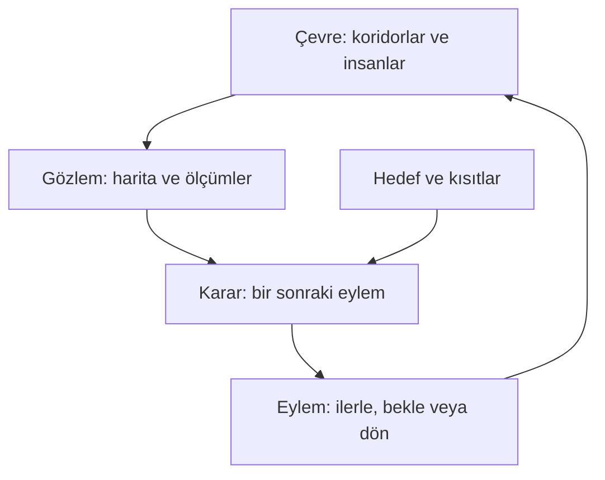

# Ders 01 — Yapay zekâ nedir?

[Kitabın giriş sayfası](../README.md) · [Temeller bölümüne dön](README.md)

**Ön koşul:** Yok.  
**Ana soru:** Bir yazılımın yaptığı işi hangi anlamda yapay zekâ olarak ele alırız?

## Bu dersin sonunda

- Yapay zekâyı bir çalışma alanı olarak açıklayabileceksin.
- Bir problemde bilgi, hedef, çıktı ve başarı ölçütünü ayırabileceksin.
- Bir sistemin karar vermesiyle öğrenmesinin farklı şeyler olduğunu göreceksin.

## 1. Somut bir soruyla başlayalım

Bir robotun depoda bir paketi teslim etmesini istiyoruz. Robotun önünde raflar, koridorlar ve hareket eden insanlar var.

“Paketi teslim et” cümlesi bizim için anlaşılır. Yazılıma ise bu isteği daha küçük sorularla ifade etmemiz gerekir:

- **Neredeyim?** Robotun konumu ne?
- **Çevremde ne var?** Önündeki şey raf mı, insan mı, boş alan mı?
- **Nereye gidebilirim?** Hangi koridorlar açık?
- **Hangi yolu seçmeliyim?** Hedefe ulaşan seçeneklerden hangisi uygun?
- **Koşullar değişirse ne yapmalıyım?** Seçilen koridora bir insan girerse nasıl davranmalı?

Bu soruların hepsi aynı hesaplama değildir. Görüntüden insanı tanımak, haritadan rota bulmak ve motorlara komut vermek ayrı görevlerdir.

Yapay zekâyı öğrenirken ilk alışkanlığımız şu olacak: **Büyük bir isteği, girdisi ve çıktısı belirli küçük problemlere ayırmak.**

## 2. Yapay zekâ ne demek?

**Yapay zekâ (Artificial Intelligence, AI)**; algılama, akıl yürütme, öğrenme, planlama ve karar verme gibi yetenekleri hesaplama yoluyla gerçekleştiren sistemleri inceleyen ve geliştiren alandır.

Bu, tek bir algoritmanın adı değildir. Alanın içinde farklı problemler ve farklı çözüm yöntemleri bulunur.

| Yetenek | Basit anlamı | Örnek |
|---|---|---|
| Algılama | Ölçümlerden çevre hakkında bilgi çıkarmak | Kamera görüntüsünde bir insanı bulmak |
| Akıl yürütme | Bilinen bilgilerden sonuç çıkarmak | Bir geçişin koşullara göre kullanılamayacağını belirlemek |
| Planlama | Hedefe ulaşmak için eylem sırası oluşturmak | Paket teslimi için koridor ve durak sırası seçmek |
| Öğrenme | Deneyim veya veriden yararlanarak bir göreve ilişkin davranışı geliştirmek | Örnek görüntülerden insan tanımayı öğrenmek |
| Karar verme | Mevcut bilgi ve hedefe göre seçenek seçmek | İlerle, bekle veya başka koridora yönel |

Bu yeteneklerin her sistemde birlikte bulunması gerekmez. Bir görüntü tanıma yazılımı yalnızca görüntü hakkında çıktı üretebilir. Bir satranç programı olası hamleleri değerlendirip hamle seçebilir.

Buradaki “akıllı” sözcüğünü mühendislik açısından ele alacağız: **Sistem tanımlı görevde ne yapabiliyor, hangi bilgiyle yapıyor ve ne kadar başarılı?**

Bir görevi başarıyla yapması, tek başına bilinçli olduğu veya insan gibi düşündüğü sonucunu vermez.

## 3. Hedef ve başarı ölçütü neden gerekli?

Depo robotuna “en iyi yolu seç” dediğimizi düşün.

“En iyi” şu anlamlara gelebilir:

- En kısa mesafeli yol.
- En az süre alan yol.
- En az enerji tüketen yol.
- İnsanların bulunduğu alanlardan mümkün olduğunca uzak geçen yol.

Bunların seçtiği rota aynı olmak zorunda değildir. Kısa bir koridor kalabalıksa daha uzun bir koridor daha hızlı olabilir.

**Hedef**, gerçekleştirmek istediğimiz şeydir: Paketi teslim etmek.  
**Başarı ölçütü**, sonucun ne kadar iyi olduğunu değerlendirme biçimidir: Örneğin güvenlik koşullarını sağlayarak teslim süresini azaltmak.

Bir de **kısıt (constraint)** vardır: Çözümün ihlal etmemesi gereken koşul. Örneğin kapalı bir koridoru kullanmamak.

Bu ayrım önemlidir. Yasak bir koridoru “kısa olduğu için biraz tercih edilebilir” saymakla, onu seçeneklerden tamamen çıkarmak farklı problem tanımlarıdır.

Önce problemi doğru kurarız; ardından çözüm yöntemi seçeriz.

## 4. Görsel: Robotun bilgi ve eylem döngüsü

Robot gibi çevreyle etkileşen bir sisteme **ajan (agent)** diyebiliriz. Ajan, çevresinden bilgi alır ve çevreyi etkileyen eylemler üretir.

Şemada iki ilişkiye dikkat et:

1. Karar, hem gözleme hem hedefe bağlıdır. Aynı koridor görüntüsünde farklı hedefler farklı kararlar doğurabilir.
2. Eylem çevredeki durumu değiştirir. Robot ilerlediğinde konumu değişir; sonraki karar yeni gözlemle verilir.

**Gözlem**, sistemin erişebildiği bilgidir. Çevrenin bütün gerçek durumunu kusursuz biçimde bilmesi gerekmez. Örneğin robot bir rafın arkasındaki insanı göremeyebilir.

Bu şema fiziksel bir robot örneğine aittir. Her AI bileşeni tek başına böyle bir eylem döngüsü kurmaz; görüntüden insan bulan modül bu döngünün bir parçası olabilir.

## 5. Küçük matematik örneği: Bir rota nasıl seçilir?

Şimdi tüm depo problemini basitleştirelim. Robotun konumu ve hedefi belli; önceden bulunmuş üç aday rota var. Mesafeleri doğru bildiğimizi ve şimdilik yalnızca toplam mesafeyi küçültmek istediğimizi varsayalım.

Her rota üç koridor parçasından oluşsun:

| Rota | Koridor mesafeleri | Toplam mesafe | Kullanılabilir mi? |
|---|---|---|---|
| A | 4 m, 3 m, 5 m | 12 m | Evet |
| B | 2 m, 2 m, 4 m | 8 m | Hayır: bir koridor kapalı |
| C | 3 m, 3 m, 4 m | 10 m | Evet |

Toplam mesafeye **maliyet (cost)** adını verelim. Burada maliyet para değil, küçültmek istediğimiz sayıdır.

Bir rota için:

$$
J(r)=d_1(r)+d_2(r)+d_3(r)
$$

Semboller:

- $r$: İncelediğimiz rota; A, B veya C.
- $d_1(r)$, $d_2(r)$, $d_3(r)$: O rotanın üç koridor parçasının uzunluğu, metre cinsinden.
- $J(r)$: Rotanın toplam mesafesi, metre cinsinden.

Örneğin C rotası için:

$$
J(C)=3+3+4=10\,\text{m}
$$

B'nin mesafesi daha küçük, ama kısıtı ihlal ediyor. Kullanılabilir seçenekler A ve C. Bunların arasında 10 m olan C'yi seçeriz.

Bu seçimi kısa biçimde şöyle yazabiliriz:

$$
r^*=\underset{r\in\{A,C\}}{\mathrm{arg\,min}}\;J(r)
$$

Burada:

- $\{A,C\}$: Seçim yapabildiğimiz kullanılabilir rotalar.
- $\mathrm{arg\,min}$: “Bu ifadeyi en küçük yapan seçeneği bul” işlemi.
- $r^*$: Seçilen rota. Yıldız işareti burada en iyi seçimi gösterir; çarpma işareti değildir.

Sonuç **$r^*=C$** olur. En küçük maliyet ise **10 m**'dir. Seçenek ile seçeneğin maliyeti farklı çıktılardır.

Bu örnek yalnızca adaylar arasından seçim yapıyor. Bir haritada aday rotaları bulmak için ayrıca bir **arama algoritması** kullanılabilir: Algoritma, olası geçişleri sistematik olarak inceler. Arama ve planlama, klasik AI'nin önemli konularındandır.

## 6. Peki bu robot öğrendi mi?

Yukarıdaki hesapta robot:

- Aday rotaları ve mesafeleri aldı.
- Kapalı koridor içeren rotayı eledi.
- Kalanların maliyetlerini karşılaştırdı.
- C rotasını seçti.

**Bu işlemler sırasında veriden yeni bir ilişki öğrenmedi.** Verilen bilgi ve kurallarla bir seçim yaptı. AI içinde kullanılan arama ve planlama yöntemleri, veriden öğrenme olmadan da çalışabilir.

Şimdi başka bir görev düşünelim: Koridorun geçilme süresini tahmin etmek istiyoruz. Mesafe tek başına yeterli olmayabilir; kalabalık ve yük de süreyi etkileyebilir.

Geçmiş yolculuk ölçümlerini kullanarak bu etkenlerle süre arasındaki ilişkiyi öğrenen bir model kurabiliriz. Bu durumda sistemin bir bileşeni veriden öğrenmiş olur. Modelin nasıl kurulduğunu ilerleyen derslerde işleyeceğiz.

Aynı robotta **öğrenilmiş bir tahmin modeli** ve **öğrenme gerektirmeyen bir rota arama yöntemi** birlikte kullanılabilir.

> Bir sistemin yeni girdiye farklı cevap vermesi, tek başına öğrenme kanıtı değildir. Sabit bir hesap da girdisi değişince farklı sonuç verir.

## 7. AI'nin sınırlarını nasıl düşünmeliyiz?

“Her otomatik işlem AI midir?” sorusunun tek ve her bağlamda kabul edilen keskin bir sınırı yoktur.

Hesap makinesi ve basit zamanlayıcı genellikle AI olarak ele alınmaz. Arama yapan bir oyun programı veya öğrenilmiş görüntü tanıma sistemi ise AI kapsamında incelenir. Bir termostatın sıcaklığa göre açılıp kapanması, tek başına karmaşık bir AI yeteneği göstermez; ajan kavramını anlatan çok basit bir örnek olarak yine de kullanılabilir.

Bu yüzden yalnızca etikete odaklanmak yerine şunları soracağız:

1. Sistem hangi görevi çözüyor?
2. Hangi bilgiye erişiyor?
3. Çıktısı ne?
4. Hangi yöntemi kullanıyor?
5. Başarısı nasıl ölçülüyor?

Örneğin “otonom araç AI kullanıyor” cümlesinden çok, “görüntüden yayaları bulmak için öğrenilmiş bir model kullanıyor” cümlesi teknik olarak daha açıklayıcıdır.

## 8. Kısa düşünce deneyi

A ve C rotalarını yeniden düşün. Mesafeleri aynı kalsın ama A kalabalık olduğu için 30 saniye, C ise 45 saniye sürsün.

Hedefimiz mesafeyi azaltmaksa C'yi seçiyoruz. Hedefimiz süreyi azaltmaksa, diğer koşulların sağlandığını varsayarak A'yı seçiyoruz.

Değişen şey robotun zekâ düzeyi değil, **neyi iyi sonuç saydığımız** oldu.

Şimdi kendine sor: “En iyi” diye tanımladığım sonuç, seçtiğim başarı ölçütünden mi geliyor, yoksa fark etmeden başka bir ölçüt mü kullanıyorum?

## 9. Anlama kontrolü

Önce cevaplarını kendi cümlelerinle yaz; ardından aşağıdaki çözümü aç.

1. “Bir sistem AI kullanıyorsa mutlaka veriden öğreniyordur.” Bu ifade neden doğru değil?
2. B rotası en kısa olduğu hâlde neden seçilmedi? Hedef, maliyet ve kısıt üzerinden açıkla.
3. Depo robotunun önünde bir insan beliriyor. Bu problemde bir gözlem, bir hedef ve bir olası eylem örneği ver.

Örnek cevapları göster

**1.** AI; öğrenmenin yanında arama, planlama ve akıl yürütme gibi yöntemleri de kapsar. Bir yöntem verilen haritayı ve kuralları kullanarak, veriden bir model öğrenmeden rota seçebilir.

**2.** Hedef paketi teslim etmek; küçültülen maliyet toplam mesafe; kısıt kapalı koridoru kullanmamaktır. B kısıtı ihlal ettiği için kullanılabilir çözümler arasında değildir. A ve C arasında C'nin maliyeti daha küçüktür.

**3.** Gözlem: Ölçümlerde önünde bir insan bulunması. Hedef: Güvenlik koşullarını sağlayarak teslim noktasına ulaşmak. Olası eylem: İnsanın geçmesini beklemek. Gerçek bir sistemde bu eylemin uygunluğu, mesafe ve hız gibi ek bilgilere bağlıdır.

## 10. Bu dersten akılda kalacak fikir

**AI bir çalışma alanıdır. Bir sistemi anlamak için görevini, eriştiği bilgiyi, ürettiği çıktıyı, yöntemini ve başarı ölçütünü açıklamalıyız. Öğrenme bu alanın içindeki yeteneklerden biridir.**

## Kaynak ve destek

Bu dersin depo ve rota örnekleri özgün öğretim örnekleridir. Aşağıdaki kaynaklar alanın kapsamı, ajan yaklaşımı ve arama–planlama bağlantısını derinleştirmek için kullanılabilir.

- **Kısa okuma:** [UC Berkeley CS188 — Agents](https://inst.eecs.berkeley.edu/~cs188/textbook/search/agents.html). İlk giriş ve ajan açıklamalarına bak. Okurken “Sistemin hedefi ve elindeki bilgi ne?” sorusunu takip et.
- **İsteğe bağlı derinleştirme:** [Russell & Norvig — Artificial Intelligence: A Modern Approach, Bölüm 1](https://aima.cs.berkeley.edu/4th-ed/pdfs/newchap01.pdf). Özellikle 1.1 bölümü: AI'ye farklı yaklaşımlar. Tam bölümü bitirmek bu ders için gerekli değil.
- **Video desteği:** [UC Berkeley CS188 Summer 2022 — ders sayfası](https://www-inst.eecs.berkeley.edu/~cs188/su22/). Takvimdeki “Welcome, Intro to AI” dersinin kayıt bağlantısı. İngilizce üniversite dersi olduğu için isteğe bağlı; ilk okumada kendi anlatımımız yeterli.
- **Görsel destek:** [AIMA — Bölüm 1 slaytları](https://aima.cs.berkeley.edu/4th-ed/slides-pdf/chapter01.pdf). Alanın farklı tanımları ve rasyonel ajan yaklaşımı.

**Sonraki ders:** [Ders 02 — AI, ML ve DL haritası](02-ai-ml-dl-haritasi.md).

[Temeller bölümüne dön](README.md)
