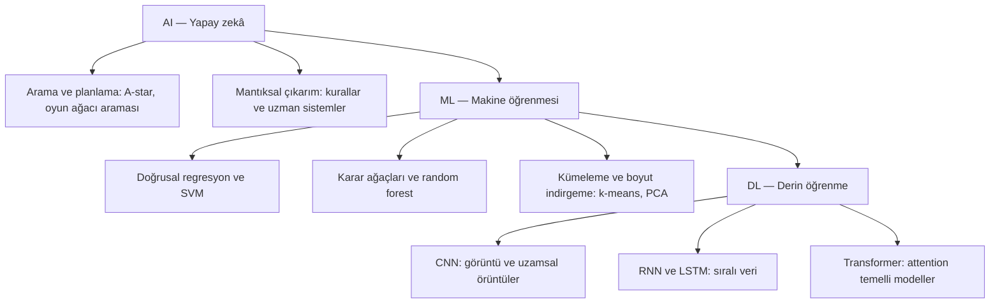

# Ders 02 — AI, ML ve DL haritası

[Önceki ders: Yapay zekâ nedir?](01-yapay-zeka-nedir.md) · [Temeller bölümüne dön](README.md)

**Ön koşul:** Ders 01.  
**Ana soru:** Yapay zekâ, makine öğrenmesi ve derin öğrenme birbirine nasıl bağlanır?

## Bu dersin sonunda

- AI, ML ve DL'nin kapsam ilişkisini açıklayabileceksin.
- Veriden öğrenen bir yöntemin neden mutlaka derin öğrenme olmadığını anlayacaksın.
- “Hangi model?” ile “Nasıl öğreniyor?” sorularını ayırabileceksin.

## 1. Üç ayrı teknoloji mi?

Bir robotun üç bileşenini düşün:

1. Haritada açık koridorları inceleyip rota bulan bir yöntem.
2. Geçmiş yolculuk kayıtlarından teslim süresini tahmin etmeyi öğrenen basit bir model.
3. Örnek görüntülerden paketleri tanımayı öğrenen çok katmanlı bir sinir ağı.

Bu bileşenlerden söz ederken AI, ML ve DL isimlerini duyabiliriz. Bunlar aynı düzeyde duran üç ayrı kutu değildir.

**Yapay zekâ (AI)** en geniş alanı ifade eder.  
**Makine öğrenmesi (Machine Learning, ML)** bu alanın içindeki veriden ve deneyimden öğrenme yöntemlerini kapsar.  
**Derin öğrenme (Deep Learning, DL)** ise ML içinde, birden fazla hesaplama katmanıyla temsiller öğrenmeye odaklanan yaklaşım ailesidir. Günümüzde bunu ağırlıklı olarak derin yapay sinir ağlarıyla gerçekleştiririz.

**Temsil (representation)**, bilginin hesaplama için ifade edildiği biçimdir. Bir görüntüyü önce piksel sayılarıyla ifade edebiliriz; ağın ara katmanları bu sayılardan göreve yararlı başka sayısal ifadeler üretmeyi öğrenebilir.

Bu yeni kelimeyi şimdilik “bilginin işlenmek üzere aldığı biçim” olarak düşün. Birazdan somutlaştıracağız.

## 2. Görsel harita: Alanlar ve örnek yöntemler

Aşağıdaki şemada oklar **alanın içindeki yaklaşım veya yöntem örneklerine** gider. Yukarıdan aşağıya bir hesaplama sırası göstermez. ML, AI'nin; DL ise ML'nin içindedir. Dallar örnek amaçlıdır ve alanın bütün yöntemlerini içermez.

Şemadaki yeni isimler şimdilik yön bulmak için var; hepsini bu derste öğrenmen gerekmiyor.

- **Arama ve planlama:** Olası yolları veya eylemleri inceleyip bir çözüm seçen yöntemler. A-star (A*) bir yol arama örneğidir.
- **Mantıksal çıkarım:** Verilen bilgiler ve kurallarla sonuç üretmek. Uzman sistemler, belirli bir alandaki bilgiyi kurallarla kullanabilir.
- **Klasik ML örnekleri:** Regresyon, SVM (support vector machine), ağaçlar, k-means ve PCA'yı ilerleyen derslerde işleyeceğiz. Bunlar aynı işi yapan yöntemler değildir.
- **DL mimarileri:** CNN (convolutional neural network), RNN (recurrent neural network), LSTM (long short-term memory) ve transformer, farklı hesaplama yapılarıdır. Yanlarındaki veri türleri yaygın kullanım örnekleridir; kullanım alanlarını yalnızca bunlarla sınırlamaz.

**Sığ yapay sinir ağları da ML kapsamındadır.** Şemada yalnızca derin ağ aileleri gösterildiği için bütün sinir ağlarını DL olarak düşünme. Ayrıca arama ve mantık yöntemleri, öğrenilmiş modellerle birlikte kullanılabilir.

Şemayı üç cümleyle oku:

- Bir derin öğrenme yöntemi aynı zamanda makine öğrenmesidir.
- Bir makine öğrenmesi yöntemi AI kapsamında yer alır.
- AI kapsamındaki her yöntem makine öğrenmesi kullanmak zorunda değildir.

Bunu matematikte **alt küme** ilişkisiyle ifade edebiliriz:

$$
\mathrm{DL}\subset\mathrm{ML}\subset\mathrm{AI}
$$

$\subset$ işareti burada “soldaki alan sağdaki alanın içinde yer alır ve onu bütünüyle kapsamaz” anlamına gelir.

Bu bir alan haritasıdır. Gerçek sistemlerde dallar birlikte çalışabilir: Bir arama yöntemi, öğrenilmiş bir modelin tahminlerini kullanabilir.

## 3. ML'de öğrenilen şey ne?

Robotun teslim süresini tahmin etmek istediğimizi düşünelim. Önceki yolculuklardan şu kayıtlar elimizde olsun:

| Yolculuk | Mesafe | Taşınan yük | Ölçülen teslim süresi |
|---|---|---|---|
| 1 | 10 m | 1 kg | 15 s |
| 2 | 20 m | 1 kg | 25 s |
| 3 | 20 m | 3 kg | 31 s |

Bunlar yalnızca öğretim için oluşturulmuş örnek ölçümlerdir; gerçek bir robotun davranışını temsil ettikleri varsayılmıyor.

Bir **model**, burada mesafe ve yükten süre tahmini üreten matematiksel bir yapıdır. Modelin ayarlanabilir sayılarına **parametre** deriz.

Örneğin ileride şöyle bir yapı seçebiliriz: Mesafenin etkisini bir sayı, yükün etkisini başka bir sayı belirlesin. Bu sayıları geçmiş kayıtlara bakarak ayarlamak, modelin eğitiminin bir parçası olur.

Burada insanlar:

- Hangi girdilerin kullanılacağını belirler.
- Modelin biçimini seçer.
- Tahmin hatasının nasıl ölçüleceğini tanımlar.

Öğrenme yöntemi ise bu kurulum içinde parametreleri veriye göre ayarlar. Dolayısıyla “veriden öğreniyor” demek, insanın bütün kararlarının ortadan kalkması anlamına gelmez.

Yeni bir mesafe ve yük için süre tahmini üreten böyle bir model **ML** örneği olabilir. Çok katmanlı bir sinir ağı kullanmadığımız için bu örneği **DL** olarak adlandırmayız.

## 4. DL'de “derin” ne anlama geliyor?

Bu kez robotun kamerasından “Bu görüntüde paket var mı?” sorusuna cevap vermek isteyelim.

Bir görüntü, bilgisayarda renk veya parlaklık değerlerini temsil eden sayılardan oluşur. Bu sayılarla “paket” sonucu arasındaki ilişki karmaşık olabilir: Işık, bakış açısı, ambalaj ve arka plan değişir.

Bir **yapay sinir ağı (artificial neural network)**, sayısal girdileri işleyip yeni sayısal çıktılar üreten bağlantılı hesaplama birimlerinden oluşur. Bu birimlerin gruplarına **katman (layer)** deriz. Bir katmanın çıktısı sonraki katmanın girdisi olabilir.

Derin öğrenmede, girdi ile çıktı arasında birden fazla öğrenilen dönüşüm bulunur. “Derin” ifadesi bu katmanlı hesaplamayı anlatır.

Bir görüntü ağı için şu sezgiyi kurabiliriz:

- İlk katmanlar yerel çizgi veya renk değişimleri gibi basit örüntülere duyarlı olabilir.
- Daha sonraki katmanlar bunları birleştirerek göreve yararlı, daha karmaşık örüntüler oluşturabilir.
- Son bölüm bu temsilleri kullanarak çıktı üretir.

Bu, açıklayıcı bir sezgidir. **Her ağın her katmanı kesin olarak “kenar”, “köşe” veya “paket” anlamına gelmez.** Öğrenilen temsiller çoğu zaman çok sayıda sayıyla dağınık biçimde ifade edilir.

ML örneğimizde mesafe ve yükü doğrudan biz seçtik. Bu görüntü örneğinde ise ağ, verilen piksel bilgisinden yararlı ara temsiller de öğrenebilir.

Derinlik; insan gibi anlama veya her zaman daha iyi sonuç verme garantisi değildir. Ayrıca tüm yapay sinir ağları “derin” sayılmaz. Derin ile sığ arasında her bağlamda kullanılan tek bir katman sayısı sınırı yoktur; önemli fikir, öğrenilen dönüşümlerin katmanlar boyunca kurulmasıdır.

## 5. Üç bileşeni yeniden sınıflandıralım

| Bileşen | AI kapsamında mı? | ML kullanıyor mu? | DL kullanıyor mu? |
|---|---|---|---|
| Verilen haritada, öğrenilmiş model kullanmadan rota aramak | Evet: arama ve planlama | Hayır | Hayır |
| Kayıtlardan eğitilmiş doğrusal modelle süre tahmin etmek | Evet | Evet | Hayır |
| Görüntü örnekleriyle eğitilmiş derin sinir ağıyla paket tanımak | Evet | Evet | Evet |

Tablo belirli örnek kurulumlarını anlatıyor. “Rota planlamada ML kullanılamaz” veya “görüntü tanıma yalnızca DL ile yapılır” sonucu çıkarma. Aynı görev farklı yöntemlerle çözülebilir.

Yöntemi belirleyen şey yalnızca **görevin adı** değildir; kurduğumuz çözümün nasıl çalıştığıdır.

## 6. Bir başka eksen: Nasıl öğreniyor?

Denetimli, denetimsiz ve pekiştirmeli öğrenme isimleri bu iç içe haritaya yeni bir halka olarak eklenmez. Öğrenme probleminin düzenini anlatırlar.

| Öğrenme düzeni | Temel fikir | Robot üzerinden örnek |
|---|---|---|
| Denetimli öğrenme (supervised learning) | Girdi örnekleriyle birlikte hedef çıktılar verilir | Mesafe ve yükten, ölçülmüş teslim süresini tahmin etmek |
| Denetimsiz öğrenme (unsupervised learning) | Belirlenmiş hedef etiketleri olmadan veride yapı aranır | Yolculukları benzer davranışlarına göre gruplamak |
| Pekiştirmeli öğrenme (reinforcement learning, RL) | Eylemlerin sonuçları ve ödüller üzerinden davranış öğrenilir | Robotun etkileşimle, uzun vadede iyi sonuç veren hareket seçimlerini öğrenmesi |

**Etiket (label)**, denetimli öğrenmede örnek için verilen hedef bilgidir. Bir sınıf adı olabileceği gibi teslim süresi gibi sayısal bir değer de olabilir.

**Ödül (reward)** ise pekiştirmeli öğrenmede bir etkileşimin sonucunu değerlendiren sayıdır. “Bu görüntünün doğru sınıfı paket” gibi bir hedef etiketiyle aynı bilgi değildir.

Bu düzenleri Ders 07'de ayrıntılı işleyeceğiz. Şimdilik iki ayrı soru olduğunu fark et:

- **Hangi model veya yöntem ailesini kullanıyoruz?** Örneğin karar ağacı veya derin sinir ağı.
- **Öğrenmeyi nasıl düzenliyoruz?** Örneğin hedef çıktılı örnekler mi veriyoruz, eylem ve sonuçlarla mı öğreniyoruz?

Bir derin ağ denetimli öğrenmeyle eğitilebilir. Derin ağlar pekiştirmeli öğrenmede de kullanılabilir. **Deep reinforcement learning**, bu iki fikrin birleşimidir. RL'nin tümü derin öğrenme değildir.

## 7. “DL daha ileri, o hâlde hep onu seçelim” diyebilir miyiz?

Model seçimini yalnızca alan haritasındaki yerine bakarak yapamayız.

Üç sütunlu az sayıda yolculuk kaydında basit bir model, başlangıç için daha uygun olabilir. Çok çeşitli görüntülerde ise derin ağların temsil öğrenmesi yararlı olabilir. Bunlar kesin seçim kuralları değil, ilk değerlendirme gerekçeleridir.

Karar verirken şu sorulara bakacağız:

- Elimizde ne kadar ve nasıl veri var?
- Hangi düzeyde hata kabul edilebilir?
- Hesaplama süresi ve donanım sınırları ne?
- Sonucu açıklamak ne kadar önemli?
- Yeni örneklerde gerçekten daha iyi çalışıyor mu?

**Daha karmaşık model, başarısı ölçülerek gerekçelendirilmelidir.** Yöntemleri öğrendikçe bunu deneylerle sınayacağız.

## 8. Kısa düşünce deneyi

“Görüntüden paketi tanıyan sistem” ifadesi tek başına DL kullandığını gösterir mi?

Bir kişi görüntüden bazı ölçüler çıkarıp bunlarla elle yazılmış kurallar kullanmış olabilir. Başka biri aynı ölçülerden öğrenen bir karar ağacı kurmuş olabilir. Bir başkası piksellerden öğrenen derin bir ağ kullanmış olabilir.

Görev aynı kaldı. **Çözüm yöntemi değişti.**

Bu nedenle bir sistemi sınıflandırırken görev adının yanında yöntemini de öğrenmeliyiz.

## 9. Anlama kontrolü

1. Bir modelin geçmiş verilerden öğrenmesi, onu neden otomatik olarak DL yapmaz?
2. Öğrenme kullanmadan rota arayan bir bileşen ile öğrenilmiş paket tanıma ağını aynı robotta kullanabilir miyiz? Bu bileşenler haritada nerede yer alır?
3. “Denetimli öğrenme bir model mimarisidir.” ifadesini düzelt. Aynı öğrenme düzeninde kullanılabilecek iki farklı model örneği ver.

Örnek cevapları göster

**1.** ML, farklı model ailelerini kapsar. Doğrusal regresyon veya karar ağacı veriden öğrenebilir; bunun için derin bir sinir ağı gerekmez.

**2.** Evet. Rota arama bileşeni AI kapsamındadır ama bu örnekte ML kullanmaz. Paket tanıma derin ağla yapılıyorsa DL, dolayısıyla ML ve AI kapsamındadır. Bu yöntemler aynı sistemin farklı görevlerinde birlikte çalışabilir.

**3.** Denetimli öğrenme, örnek girdilerle hedef çıktıların birlikte verildiği öğrenme düzenidir. Modelin yapısı ayrı bir seçimdir: Karar ağacı da derin bir sinir ağı da denetimli öğrenmeyle eğitilebilir.

## 10. Akılda kalacak harita

**AI geniş alan; ML onun öğrenme yöntemleri; DL ise ML içindeki derin temsil öğrenme yaklaşımıdır. Öğrenme düzeni, kullandığımız model ailesinden ayrı bir sorudur.**

## Kaynak ve destek

Robot, yolculuk kayıtları ve karşılaştırma tablosu özgün öğretim örnekleridir.

- **Ana destek:** [Dive into Deep Learning — Introduction](https://d2l.ai/chapter_introduction/index.html). ML motivasyonu ve derin öğrenmeye giriş kısımlarını incele. Ayrıntılı tarihçeyi bu aşamada bitirmen gerekmiyor.
- **Görsel/video:** [3Blue1Brown — But what is a Neural Network?](https://www.3blue1brown.com/lessons/neural-networks/). Katmanların neden kullanıldığını anlatan “Why Use Layers?” bölümüne odaklan. Sayfadaki video ve görseller destek içindir; nöron matematiğine geldiğimizde yeniden döneceğiz.
- **İsteğe bağlı okuma:** [Goodfellow, Bengio ve Courville — Deep Learning, Introduction](https://www.deeplearningbook.org/contents/intro.html). AI–ML–DL kapsam ilişkisini gösteren Figure 1.4 ve çevresindeki açıklamalar. Tam bölümü bitirmek gerekli değil.

[Önceki ders: Yapay zekâ nedir?](01-yapay-zeka-nedir.md) · [Temeller bölümüne dön](README.md)

**Sonraki ders:** [Ders 03 — Elle yazılan kurallar ve veriden öğrenme](03-kurallar-ve-veriden-ogrenme.md).
