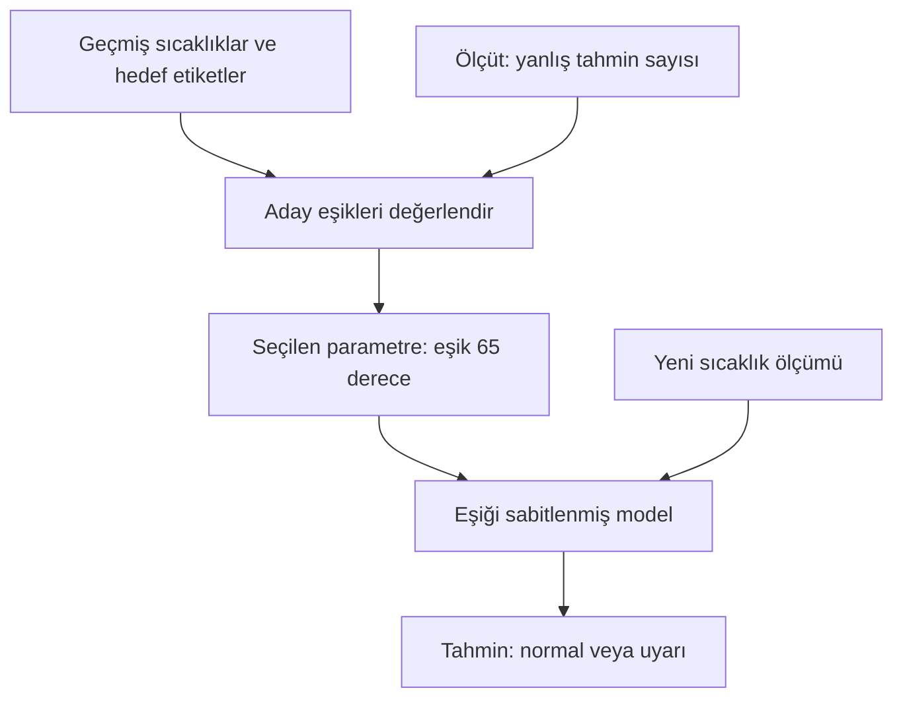

# Ders 03 — Elle yazılan kurallar ve veriden öğrenme

[Önceki ders: AI, ML ve DL haritası](02-ai-ml-dl-haritasi.md) · [Temeller bölümüne dön](README.md)

**Ön koşul:** Ders 01 ve 02.  
**Ana soru:** Bir davranışı elle tanımlamakla, o davranışın parametrelerini veriden öğrenmek arasındaki fark nedir?

## Bu dersin sonunda

- Kural tabanlı bir çözüm ile öğrenilen modeli aynı görevde karşılaştırabileceksin.
- Modelin yapısıyla öğrenilen parametreyi ayırabileceksin.
- Eğitim sırasında yapılan seçimi küçük bir örnekte elle doğrulayabileceksin.

## 1. Aynı problem, iki çözüm

Bir motorun sıcaklığını ölçüyoruz. Yazılımın “normal” veya “uyarı” çıktısı üretmesini istiyoruz.

Bu derste yalnızca tek bir sıcaklık ölçümü kullanacağız. Gerçekte motor durumu; yük, soğutma, çalışma süresi ve başka ölçümlere de bağlı olabilir.

**Bütün sıcaklıklar ve etiketler öğretim için oluşturulmuştur. Gerçek bir motor için güvenli çalışma sınırı önermezler.**

İki farklı kurulum düşünelim:

- Bir mühendis, uyarının başlayacağı sıcaklığı doğrudan belirliyor.
- Bir öğrenme algoritması, önceki ölçümler ve bunların hedef etiketlerine bakarak eşiği seçiyor.

İki sistem sonunda aynı biçimde karar verebilir: “Sıcaklık eşikten büyük veya eşitse uyar.” Ayrım, **eşik değerinin nasıl belirlendiğidir.**

## 2. Elle yazılan kural

Mühendis örnek olarak 80 °C eşiğini seçsin:

- Sıcaklık 80 °C'nin altındaysa “normal”.
- Sıcaklık 80 °C veya üzerindeyse “uyarı”.

Bu kararın sözde kodu şöyle görünür. **Sözde kod (pseudocode)**, bir işlemi belirli bir programlama dilinin bütün kurallarına bağlı kalmadan anlatır.

```text
Eğer sıcaklık >= 80 ise:
    çıktı = "uyarı"
Aksi hâlde:
    çıktı = "normal"
```

70 °C geldiğinde normal, 90 °C geldiğinde uyarı çıktısı oluşur.

Çıktılar farklı olsa da sistem bu sırada öğrenmiş değildir. **Girdi değişti; karar kuralı değişmedi.**

Buradaki 80 değeri mühendislik bilgisi, bir gereksinim veya başka bir gerekçeyle seçilmiş olabilir. “Elle seçildi” demek “rastgele veya kötü seçildi” anlamına gelmez.

## 3. Öğrenilecek modelin yapısı

Şimdi eşik değerini sabit yazmak yerine ayarlanabilir bırakalım.

Modelin yapısı yine aynı olsun:

- Sıcaklık seçilen eşiğin altındaysa normal.
- Sıcaklık seçilen eşik veya üzerindeyse uyarı.

Eşiği $\theta$ ile gösterelim. Bu harf “teta” diye okunur. **Parametre**, modelin davranışını değiştiren ayarlanabilir sayıdır. Bu örnekte tek parametremiz eşik sıcaklığıdır.

Matematiksel olarak:

$$
\hat{y}=f_{\theta}(T)
$$

- $T$: Modele verdiğimiz sıcaklık ölçümü, °C cinsinden.
- $\theta$: Eşik sıcaklığı, °C cinsinden.
- $f_{\theta}$: Eşiği $\theta$ olan karar fonksiyonu.
- $\hat{y}$: Modelin ürettiği sınıf tahmini; “normal” veya “uyarı”. Üzerindeki şapka, bunun tahmin olduğunu hatırlatır.

Fonksiyonun yaptığı işlem, yukarıdaki iki koşuldan ibarettir. $\theta$ değiştiğinde aynı sıcaklık için çıktı değişebilir.

| Sıcaklık | Eşik 65 °C | Eşik 85 °C |
|---|---|---|
| 70 °C | Uyarı | Normal |

70 sayısı aynı. Kararı değiştiren şey modelin parametresi.

**Model ailesini**, yani kullanabileceğimiz eşik kurallarının biçimini biz seçtik. Öğrenme algoritmasına bırakacağımız şey bu örnekte yalnızca eşik değeridir.

## 4. Veriden öğrenmek için hangi bilgi gerekiyor?

Önceki gözlemlerden şu örnek kayıtları aldığımızı varsayalım:

| Örnek | Sıcaklık | Hedef etiket |
|---|---|---|
| 1 | 40 °C | Normal |
| 2 | 50 °C | Normal |
| 3 | 60 °C | Normal |
| 4 | 70 °C | Uyarı |
| 5 | 80 °C | Uyarı |
| 6 | 90 °C | Uyarı |

**Hedef etiket**, modelin o örnekte üretmesini istediğimiz cevaptır. Bu, denetimli öğrenmenin küçük bir örneğidir: Hem girdiler hem hedef çıktılar verilmiştir.

Etiketleri sıcaklık sütunundan bağımsız bir değerlendirme sürecinin sağladığını varsayıyoruz. Gerçek bir uygulamada etiketin kaynağı ve güvenilirliği açıklanmalıdır.

Eğer etiketleri zaten “80 °C ve üzeri uyarı” kuralıyla üretseydik, öğrenme işlemi o kuralı taklit ediyor olurdu. Veriden bağımsız yeni bir motor sağlığı bilgisi elde ettiğimizi söyleyemezdik.

## 5. Elle çözelim: Hangi eşik daha iyi?

Öğrenme algoritmamız çok basit olsun:

1. Üç aday eşik dene: 50, 65 ve 85 °C.
2. Her adayla altı örneğin çıktısını hesapla.
3. Tahminleri hedef etiketlerle karşılaştır.
4. En az yanlış tahmin yapan eşiği seç.

Bu da bir öğrenme algoritmasıdır: Parametreyi verilen örnekler ve tanımladığımız başarı ölçütüne göre seçiyor. Sinir ağı veya gradyan inişi kullanmak zorunda değiliz.

| Sıcaklık | Hedef | Eşik 50 °C | Eşik 65 °C | Eşik 85 °C |
|---|---|---|---|---|
| 40 °C | Normal | Normal | Normal | Normal |
| 50 °C | Normal | **Uyarı: yanlış** | Normal | Normal |
| 60 °C | Normal | **Uyarı: yanlış** | Normal | Normal |
| 70 °C | Uyarı | Uyarı | Uyarı | **Normal: yanlış** |
| 80 °C | Uyarı | Uyarı | Uyarı | **Normal: yanlış** |
| 90 °C | Uyarı | Uyarı | Uyarı | Uyarı |
| **Yanlış sayısı** | — | **2** | **0** | **2** |

Örneğin 50 °C eşiğinde, 50 ve 60 °C girdileri için uyarı üretiyoruz. Hedefler normal olduğu için iki hata var.

Bu derste iki hata türünü eşit ağırlıkla sayıyoruz. Gerçek bir uygulamada gereksiz uyarı ile bir sorunu kaçırmanın sonuçları farklı olabilir; ölçüt buna göre seçilmelidir.

**Hata oranını** şöyle tanımlayalım:

$$
E(\theta)=\frac{\text{Yanlış tahmin sayısı}}{\text{Toplam örnek sayısı}}
$$

$E(\theta)$, $\theta$ eşiğini kullanan modelin bu örneklerdeki hata oranıdır. Birimi yoktur.

Üç aday için:

$$
E(50)=\frac{2}{6}\approx0.333,\qquad
E(65)=\frac{0}{6}=0,\qquad
E(85)=\frac{2}{6}\approx0.333
$$

0.333 yaklaşık %33.3 hata demektir. Denediğimiz üç aday arasında **65 °C** en düşük hata oranını veriyor.

Böylece öğrenme işleminin çıktısı “bu anki motor durumu” değil, **seçilmiş parametredir**. Bu parametreyi taşıyan model daha sonra yeni ölçümleri sınıflandırır.

Bu veriler eşiği tek bir değere zorlamaz: 60 °C'den büyük ve 70 °C'ye eşit veya küçük başka eşikler de aynı altı etiketi doğru ayırır. **65'i seçmemizin nedeni, denediğimiz adaylar arasında sıfır hatalı tek seçenek olmasıdır.** Bu örnekten “motorun gerçek sınırı tam 65 °C” sonucu çıkmaz.

## 6. Görsel: Modeli oluşturmak ve kullanmak

Aşağıdaki şema, örneklerden parametre seçme ile seçilmiş modeli kullanma arasındaki bağı gösteriyor.



**Eğitim (training)** kısmında geçmiş örneklerin hedeflerini biliyoruz ve eşiği seçiyoruz.

**Tahmin üretme (inference)** kısmında ise seçilmiş modele yeni bir sıcaklık veriyoruz. Bu aşamada doğru etiketi modelin girdisine eklemiyoruz.

Eğitim bittikten sonra parametre sabit tutulabilir. Yeni ölçüm gelmesi, kendiliğinden yeniden eğitim yapıldığı anlamına gelmez.

## 7. Yeni örneklerde ne olur?

Eşik artık 65 °C olsun:

| Yeni sıcaklık | Modelin tahmini |
|---|---|
| 55 °C | Normal |
| 75 °C | Uyarı |

Bu iki tahmini hesaplamak kolay. Fakat tabloda hedef etiket yok. **Tahmin üretmiş olmak, tahminin doğru olduğunu bildiğimiz anlamına gelmez.**

Yeni örneklerin güvenilir hedef bilgilerini daha sonra elde edip karşılaştırmamız gerekir.

Modelin eğitimde kullanılmamış örneklerde de işe yaramasına **genelleme (generalization)** deriz. Altı eğitim örneğinde sıfır hata, genellemenin kanıtı değildir.

Örneğin yükün çok farklı olduğu bir çalışma koşulunda 60 °C için hedef etiket uyarı olabilir. Modelimiz yalnızca sıcaklığı görüyor ve normal diyecek. Daha önce görmediği bir etkeni, girdilerinde bulunmadığı hâlde otomatik olarak hesaba katmasını bekleyemeyiz.

## 8. Kural ve öğrenme arasındaki asıl ayrım

| Soru | Elle belirlenen eşik | Veriden seçilen eşik |
|---|---|---|
| Kararın biçimini kim belirledi? | İnsan | Bu örnekte yine insan |
| Eşik nereden geldi? | İnsan tarafından verilen değer | Örnekler ve hata ölçütüyle yapılan seçim |
| Kullanım sırasında ne oluyor? | Ölçüm, kuralla karşılaştırılıyor | Ölçüm, öğrenilmiş eşikle karşılaştırılıyor |
| Her yeni ölçümde öğreniyor mu? | Hayır | Bu kurulumda hayır |
| Yanlış sonuç üretebilir mi? | Evet | Evet |

Aynı biçimde yazılmış iki karar fonksiyonundan biri elle ayarlanmış, diğeri veriden öğrenilmiş olabilir.

Öğrenme de yazılımla gerçekleştirilir. Fark, yazılımın olmaması değil; **davranışın bazı ayrıntılarının veriye göre seçilmesidir.**

## 9. Ne zaman hangisini düşünürüz?

Bir ilişki açıkça tanımlanmışsa veya kesin bir koşul uygulanacaksa, doğrudan kural yazmak uygun olabilir. Örneğin bir dosyanın zorunlu alanlarının dolu olup olmadığını kontrol etmek için model eğitmemiz gerekmez.

Görüntü veya ses gibi çok çeşitli girdilerde tüm ilişkileri elle tarif etmek zorlaşabilir. Veriden öğrenmek burada yardımcı olabilir. Bunun için de uygun veri, model ve değerlendirme gerekir.

İki yaklaşım bir arada da kullanılabilir: Öğrenilmiş bir model tahmin üretirken, ayrıca tanımlanmış koşullar bu tahmine göre yapılabilecek eylemleri sınırlandırabilir.

Seçimi “öğrenme her zaman daha iyi” varsayımıyla değil, problemin gerektirdiği davranış ve ölçülen sonuçla yapacağız.

## 10. Kısa deney ve anlama kontrolü

1. Aday eşiklere **70 °C** ekle. Yukarıdaki altı örnek için kaç hata yapıyor? Bu sonuç eşik seçimi hakkında ne söylüyor?
2. Sistem yeni sıcaklıklarda farklı çıktılar üretiyor ama eşik hep 65 °C kalıyor. Bu sırada öğreniyor mu?
3. Eğitimde altı örneğin tamamı doğru sınıflandı. Gerçek bir motor üzerinde güvenilir olduğunu söylemek için hangi bilgiler eksik?

<details>
<summary>Örnek cevapları göster</summary>

**1.** Sıfır hata. 40, 50 ve 60 normal; 70, 80 ve 90 uyarı olur. 65 ve 70 aynı eğitim hatasını verdiği için hata sayısı tek başına bu iki aday arasında seçim yaptırmaz. Ek bir seçim kuralı kullanılabilir, ama bu verilerden benzersiz bir gerçek eşik bulunduğu söylenemez.

**2.** Bu kurulumda hayır. Model sabit parametreyle tahmin üretiyor; yalnızca girdi değişiyor.

**3.** Veriler burada yapay ve çok az. Gerçek, temsil edici ölçümler; etiketlerin güvenilir kaynağı; farklı çalışma koşulları; eğitimde kullanılmamış verilerde değerlendirme ve hata türlerinin sonuçları gibi bilgiler gerekir. Bu örnek yalnızca öğrenme mekanizmasını açıklıyor.

</details>

## Kaynak ve destek

Sıcaklık verileri, eşik adayları ve hesaplar özgün öğretim örnekleridir.

- **Ana okuma:** [Dive into Deep Learning — Introduction, 1.1 A Motivating Example](https://d2l.ai/chapter_introduction/index.html#a-motivating-example). Özellikle bir davranışı doğrudan programlamak yerine parametreleri örneklerle ayarlama fikrini takip et. Figure 1.1.2 eğitim sürecine görsel destek sağlar.
- **İsteğe bağlı video/görsel:** [3Blue1Brown — But what is a Neural Network?](https://www.3blue1brown.com/lessons/neural-networks/). Girişteki el yazısı rakam tanıma örneğini, “Bütün çeşitliliği kurallarla nasıl tarif ederdim?” sorusuyla incele. Ağın denklemlerini bu aşamada çözmen gerekmiyor.

[Önceki ders: AI, ML ve DL haritası](02-ai-ml-dl-haritasi.md) · [Temeller bölümüne dön](README.md)

**Sonraki ders:** [Ders 04 — Bir öğrenme probleminin parçaları](04-ogrenme-probleminin-parcalari.md).
