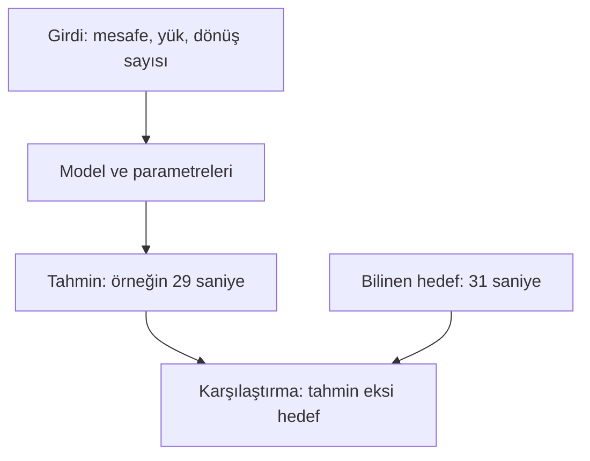

# Ders 04 — Bir öğrenme probleminin parçaları

[Önceki ders: Kurallar ve veriden öğrenme](03-kurallar-ve-veriden-ogrenme.md) · [Temeller bölümüne dön](README.md)

**Ön koşul:** Ders 01–03.  
**Ana soru:** Bir veri tablosunu öğrenme problemine dönüştürürken hangi parçaları ayırmalıyız?

## Bu dersin sonunda

- Örnek, girdi, özellik, hedef, tahmin ve parametreyi ayırabileceksin.
- Bir tabloyu özellik matrisi ve hedef vektörü olarak okuyabileceksin.
- Tahmin anında hangi bilgilerin kullanılabileceğini sorgulayabileceksin.

Bu derste **denetimli öğrenme** üzerinden ilerliyoruz: Geçmiş girdilerin yanında hedef çıktıları da biliyoruz. Her öğrenme düzeninde bu biçimde hedef etiketi bulunması gerekmez.

## 1. Önce görevi tek cümleyle kur

Bir depo robotunun yolculuk kayıtları elimizde olsun. Görevimiz:

> Robot yola çıkmadan önce, planlanan rota ve yük bilgileriyle teslim süresini tahmin etmek.

“Yola çıkmadan önce” ifadesi önemlidir. Modelin o anda erişebileceği bilgiler, yolculuk bittikten sonra bildiklerimizden farklıdır.

Örnek veri tablomuz:

| Yolculuk kimliği | Planlanan mesafe (m) | Yük (kg) | Planlanan dönüş sayısı | Ölçülen teslim süresi (s) |
|---|---|---|---|---|
| A | 10 | 1 | 0 | 15 |
| B | 20 | 1 | 0 | 25 |
| C | 20 | 3 | 0 | 31 |
| D | 20 | 3 | 2 | 39 |

Bu sayılar özgün, yapay öğretim verileridir. Dört kayıt gerçek bir modeli değerlendirmek için yeterli veri olarak sunulmuyor.

Şimdi tablonun parçalarını tek tek ayıralım.

## 2. Örnek: Tablodaki bir satır

Bir **örnek (sample veya observation)**, bu problemde tek bir yolculuk kaydıdır.

Örneğin C satırı:

- Planlanan mesafe: 20 m.
- Yük: 3 kg.
- Planlanan dönüş sayısı: 0.
- Yolculuk bittikten sonra ölçülen süre: 31 s.

Bu tabloda dört örnek var. Örnek sayısını $n$ ile göstereceğiz; burada $n=4$.

“Bir örnek” her zaman bir yolculuk değildir. Göreve göre bir görüntü, bir ses kaydı, bir ev veya belirli bir zaman aralığındaki sensör ölçümleri olabilir.

Örnek tanımını belirlemeden veri sayısını yorumlayamayız. Bir yolculuğun her saniyesini ayrı satır yaparsak satır sayısı büyür, ama yeni satırlar birbirinden bağımsız yolculuklar hâline gelmez.

## 3. Girdi ve özellik: Model hangi bilgiyi görüyor?

**Girdi (input)**, tahmin üretmesi için modele verdiğimiz bilgidir.

**Özellik (feature)**, bu bilgiyi ifade etmek için kullandığımız bir ölçü veya bileşendir. Burada üç özellik seçiyoruz:

1. Planlanan mesafe.
2. Yük.
3. Planlanan dönüş sayısı.

Özellik sayısını $p$ ile gösterelim. Bu örnekte $p=3$.

Girdi ile özellik arasındaki ilişkiyi şöyle düşün:

- “C yolculuğunun bilgisi” tek bir örneğin girdisidir.
- Bu girdiyi **üç özellik değerinden** oluşan bir vektörle temsil ediyoruz.

**Vektör**, sayıları belirli bir sırada bir arada tutan matematiksel nesnedir. C yolculuğu için sütun vektörü:

$$
\mathbf{x}_3=
\begin{bmatrix}
20\\
3\\
0
\end{bmatrix}
$$

- $\mathbf{x}_3$: Üçüncü örneğin özellik vektörü. Kalın yazı burada vektörü belirtir.
- İlk sayı mesafe, ikinci sayı yük, üçüncü sayı dönüş sayısıdır.
- Vektörün boyutu $3\times1$: Üç satır, bir sütun.

Bileşenlerin birimleri farklı olabilir. Bu vektörü “20 m, 3 kg, 0 dönüş” olarak yorumluyoruz. Matematikte sayıları bir araya koymamız, birimlerini veya anlamlarını ortadan kaldırmaz.

**Sıra sabit kalmalıdır.** Eğitimde mesafe–yük–dönüş sırası kullanıp yeni veride yük–mesafe–dönüş sırası verirsek model sayıları yanlış anlamlarla işler.

## 4. Hedef: Modelin tahmin etmesini istediğimiz bilgi

**Hedef (target)** veya **etiket (label)**, öğrenmesini istediğimiz çıktının geçmiş örnekteki bilinen değeridir.

Bu görevde hedef, ölçülen teslim süresidir. Üçüncü örnekte:

$$
y_3=31
$$

$y_3$, C yolculuğunun hedef süresidir; birimi saniyedir.

Etiket yalnızca “normal”, “uyarı” veya “paket” gibi sınıf adı olmak zorunda değildir. Bu örnekte sayısal bir süredir.

**Hedef, modelin bu görevdeki giriş özelliklerinden biri değildir.** Geçmiş yolculukta bildiğimiz süreyi eğitim ve değerlendirmede kullanırız. Yeni yolculuğun süresini zaten bilseydik onu tahmin etme problemimiz kalmazdı.

Bir denetimli öğrenme örneğini artık şöyle gösterebiliriz:

$$
(\mathbf{x}_3,y_3)
$$

Bu ifade, “üçüncü yolculuğun girdisi ve ona karşılık gelen hedefi” demektir.

## 5. Veri kümesi: Örnekleri bir araya getir

**Veri kümesi (dataset)**, bu görev için topladığımız örnekler bütünüdür.

Giriş değerlerini ayrı, hedefleri ayrı tutalım:

$$
X=
\begin{bmatrix}
10 & 1 & 0\\
20 & 1 & 0\\
20 & 3 & 0\\
20 & 3 & 2
\end{bmatrix},
\qquad
\mathbf{y}=
\begin{bmatrix}
15\\
25\\
31\\
39
\end{bmatrix}
$$

$X$ özellik matrisidir. **Matris**, sayıları satır ve sütunlarla düzenleyen yapıdır.

- $X$'in her satırı bir yolculuğu gösterir.
- Her sütunu aynı özellik türünü gösterir.
- $X$'in boyutu $n\times p=4\times3$.
- $\mathbf{y}$ hedef vektörüdür; boyutu $4\times1$.
- $X$'in üçüncü satırı ile $\mathbf{y}$'nin üçüncü elemanı aynı yolculuğa aittir.

Az önce $\mathbf{x}_3$'ü sütun vektörü olarak yazdık. $X$ içinde ise aynı değerler üçüncü **satırda** duruyor. Bu bir çelişki değil: Tek örneği sütun vektörü, örneklerin tümünü satırlarda tutma gösterimini seçtik.

Örneğin $X_{3,2}=3$ ifadesi, **üçüncü örneğin ikinci özelliğini**, yani C yolculuğunun 3 kg yükünü gösterir. İki indis farklı görev yapar: İlki satır, ikincisi sütun.

Yolculuk kimliğini $X$'e koymadık. A, B, C ve D burada kayıtları eşleştirmeye yarıyor; süre tahmini için giriş olarak seçilmedi. Tabloda bulunan her sütun otomatik olarak özellik değildir.

## 6. Model, parametre ve tahmin

**Model**, seçilmiş girdiyi çıktıya dönüştüren matematiksel yapıdır. **Parametre**, bu yapının davranışını ayarlayan sayıdır.

Ders 03'teki modelde parametre eşik sıcaklığıydı. Bu görevde hangi modeli kullanacağımızı henüz seçmedik. Genel olarak:

$$
\hat{y}_i=f_{\theta}(\mathbf{x}_i)
$$

- $i$: İncelediğimiz örneğin numarası; burada 1–4 arasında.
- $\mathbf{x}_i$: O örneğin özellik vektörü.
- $f_{\theta}$: Parametreleri $\theta$ ile gösterilen model.
- $\theta$: Modelin ayarlanabilir sayıları; modele göre tek sayı veya birçok sayı olabilir.
- $\hat{y}_i$: Modelin süre tahmini, saniye cinsinden.
- $y_i$: Geçmiş örnekte ölçülmüş hedef süre, saniye cinsinden.

Örneğin bir model C yolculuğu için 29 s tahmin etmiş olsun:

$$
\hat{y}_3=29,\qquad y_3=31
$$

Tahmini hedeften çıkararak değil, **tahmin eksi hedef** biçiminde bir fark tanımlayalım:

$$
e_3=\hat{y}_3-y_3=29-31=-2\ \text{s}
$$

$e_3$, burada tanımladığımız tahmin farkıdır. Negatif olması, tahminin ölçülen süreden 2 s düşük olduğunu gösterir. Bu işaret seçimi bir tanımdır; başka kaynaklarda ters işaretle karşılaşabilirsin.

Modelin 29'u nasıl ürettiğini bu derste hesaplamıyoruz; sayı, hedef ile tahmini ayırmak için verilmiş varsayımsal bir çıktıdır. Modelin yapısını sonraki derste açacağız.

## 7. Görsel: Hedef hangi yoldan kullanılır?

Şemada hedefin modelin girişine değil, **karşılaştırmaya** gittiğine dikkat et.

Eğitim sırasında bu karşılaştırmalardan bir hata ölçütü oluşturup parametre seçebiliriz. Model kullanılmaya başladığında yeni girdiden tahmin üretiriz; doğru hedef henüz bilinmeyebilir.

Özellik ile parametreyi de ayır:

| Bilgi | Görevi | Bu örnekte |
|---|---|---|
| Özellik | Bir örneği tarif eder | Yolculuğun yükü: 3 kg |
| Parametre | Modelin girdiyi nasıl işleyeceğini belirler | Yükün tahmine etkisini ayarlayan, ileride öğreneceğimiz bir sayı |
| Hedef | Geçmiş örneğin tahmin edilmek istenen sonucudur | Ölçülen süre: 31 s |
| Tahmin | Modelin verdiği cevaptır | Tahmini süre: 29 s |

Farklı yolculuklarda yük değişebilir. Eğitimi tamamlanmış modelin parametreleri ise kullanım sırasında sabit tutulabilir.

## 8. Tahmin anında bu özellik elimizde olacak mı?

Veri tablosuna “gerçekte beklenen toplam süre” sütunu eklediğimizi düşün. Bu süre ancak yolculuk bittikten sonra kayıtlardan hesaplanabiliyor olsun.

Teslim süresini tahmin etmeye çok yardımcı görünebilir. Fakat görevi **yola çıkmadan önce** yapıyoruz; o anda bu bilgi yok.

Eğitimde böyle bir sütunu kullanırsak model, gerçek kullanımda erişemeyeceği bilgiden yararlanır. Bu, **veri sızıntısının (data leakage)** bir örneğidir: Değerlendirme, gerçek tahmin koşullarını olduğundan daha kolay hâle getirir.

Özellik seçerken yalnızca “hedefle ilişkili mi?” sorusunu sormayacağız. **“Tahmin yaptığım anda bu bilgiye erişebilir miyim?”** sorusunu da soracağız.

Planlanan dönüş sayısı yola çıkmadan önce bilinebilir. Yolculuk sırasında gerçekten yapılan dönüş sayısı ise rota değişmişse farklı olabilir. Benzer isimli iki sütunun kullanılabilirliği aynı olmayabilir.

## 9. Öğrenme probleminin kısa tarifi

Bu örneği artık şu parçalarla anlatabiliriz:

| Parça | Tanımımız |
|---|---|
| Görev | Yola çıkmadan teslim süresini tahmin etmek |
| Bir örnek | Tek bir yolculuk |
| Girdi özellikleri | Planlanan mesafe, yük, planlanan dönüş sayısı |
| Hedef | Ölçülen teslim süresi |
| Veri kümesi | Bu bilgileri eşleştiren yolculuk kayıtları |
| Model | Girdi vektöründen süre üreten yapı; henüz seçmedik |
| Eğitim ölçütü | Tahminlerle hedefler arasındaki farkları değerlendiren ölçüt; ayrıntısını ileride kuracağız |
| Değerlendirme | Modeli öğrenirken kullanılmamış yolculuklarda tahminleri ölçülen sürelerle karşılaştırmak |

Dört örneği tek tabloda göstermemiz, aynı örneklerdeki başarının yeterli olduğu anlamına gelmez. Eğitim ve değerlendirme için veri ayırmayı ileride işleyeceğiz.

Bu ayrımlar netleştiğinde kodda karşılaşacağın $X$, $\mathbf{y}$ veya “features” isimleri de anlam kazanır: Bunlar tablonun farklı görevleri olan parçalarıdır.

## 10. Kısa deney ve anlama kontrolü

1. Beşinci kayıt şöyle olsun: 30 m, 2 kg, 1 planlanan dönüş, 42 s ölçülen süre. Özellik vektörünü ve hedefini ayrı yaz. Eklediğinde $X$'in boyutu ne olur?
2. Birisi “Dört örnek ve dört özellik var, çünkü süre de bir sütun” diyor. Bu görev için neden yanlış?
3. Modele “yolculuğun bitiş saati”ni giriş olarak vermek istiyoruz. Yola çıkmadan süre tahmin etme görevinde bunu neden sorgulamalıyız?

Örnek cevapları göster

**1.** Özellik vektörü mesafe–yük–dönüş sırasıyla 30, 2, 1 değerlerini taşıyan üç elemanlı sütun vektörüdür. Hedef $y_5=42$ saniyedir. Beş örnek ve üç özellik olduğu için $X$'in boyutu $5\times3$ olur.

**2.** Dört örnek var, ama giriş olarak üç özellik seçtik. Süre hedef sütunudur; girişe eklenmez. Yolculuk kimliği de bu görevde seçilmiş özellik değildir.

**3.** Gerçek bitiş saati tahmin anında bilinmez. Üstelik başlangıç saatiyle birlikte hedef süreyi doğrudan açığa çıkarabilir. Geçmiş kayıtta bulunması, tahmin sırasında kullanılabileceği anlamına gelmez.

## Kaynak ve destek

Yolculuk tablosu, sayısal örnekler ve şema özgün öğretim materyalleridir.

- **Kısa okuma:** [Dive into Deep Learning — Key Components](https://d2l.ai/chapter_introduction/index.html#key-components). Data, Models, Objective Functions ve Optimization Algorithms başlıkları. Öncelikle veri ve model ayrımına odaklan; optimizasyon ayrıntılarını ileride işleyeceğiz.
- **Matematik desteği:** [Dive into Deep Learning — Linear Algebra](https://d2l.ai/chapter_preliminaries/linear-algebra.html). Vectors ve Matrices bölümleri. Buradaki $X$ ve $\mathbf{y}$ gösterimini bu tanımlarla eşleştir.
- **Video/görsel desteği:** [3Blue1Brown — But what is a Neural Network?](https://www.3blue1brown.com/lessons/neural-networks/). “The Structure of a Neural Network” bölümünde görüntüdeki piksel değerlerinin nasıl giriş olarak ifade edildiğine bak. Bu dersteki üç özellikli vektörün bir başka veri türüne nasıl genişlediğini düşün.

[Önceki ders: Kurallar ve veriden öğrenme](03-kurallar-ve-veriden-ogrenme.md) · [Temeller bölümüne dön](README.md)

[Sonraki ders: Model ve parametre](05-model-ve-parametre.md)
