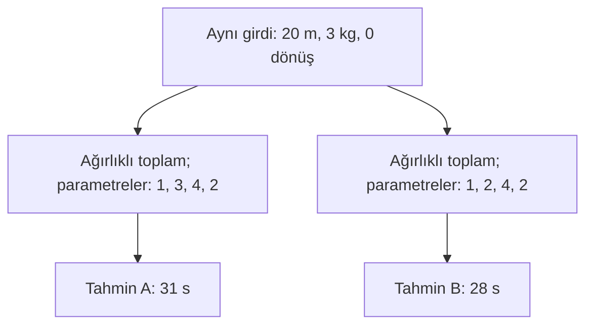

# Ders 05 — Model ve parametre

[Önceki ders: Bir öğrenme probleminin parçaları](04-ogrenme-probleminin-parcalari.md) · [Temeller bölümüne dön](README.md)

**Ön koşul:** Ders 03–04.  
**Ana soru:** Modelin hesaplama biçimi ile bu hesaplamada kullandığı sayılar nasıl ayrılır?

## Bu dersin sonunda

- Modelin biçimini, parametrelerini ve girdisini ayırabileceksin.
- Basit bir modelde teslim süresi tahminini elle hesaplayabileceksin.
- Farklı çıktı üretmek ile öğrenmek arasındaki farkı açıklayabileceksin.

## 1. Veriden cevaba nasıl geçeceğiz?

Önceki derste bir robotun teslim süresini tahmin etmek istiyorduk. Her yolculuğu üç özellik ile tarif ettik:

| Sembol | Özellik | Birim |
|---|---|---|
| $x_1$ | Planlanan mesafe | m |
| $x_2$ | Yük | kg |
| $x_3$ | Planlanan dönüş sayısı | dönüş |

C yolculuğunda bu değerler 20 m, 3 kg ve 0 dönüştü. Ölçülen hedef süre $y=31$ saniyeydi.

Üç sayıyı yan yana koymak henüz tahmin üretmez. **Bu sayılardan süre hesaplayan bir ilişki seçmemiz gerekir.**

Bir **model (model)**, bu görevde girdiyi süre tahminine dönüştüren matematiksel yapıdır. Gerçek yolculuğun bütün ayrıntılarını içermesi gerekmez; seçtiğimiz bilgilerle yararlı bir tahmin üretmesini bekleriz.

## 2. Modelin biçimi: Hangi işlemleri yapacağız?

Basit bir fikir kuralım:

> Mesafe, yük ve dönüş sayısının süreye ayrı ayrı katkıları olsun. Bu katkıları ve sabit bir süreyi toplayalım.

Her özelliğin katkısını ayarlamak için onu bir katsayıyla çarpıyoruz:

$$
\hat{y}=w_1x_1+w_2x_2+w_3x_3+b
$$

| Sembol | Anlamı | Bu örnekte birimi |
|---|---|---|
| $\hat{y}$ | Tahmin edilen teslim süresi | s |
| $w_1$ | Mesafenin katkısını ayarlayan katsayı | s/m |
| $w_2$ | Yükün katkısını ayarlayan katsayı | s/kg |
| $w_3$ | Dönüş sayısının katkısını ayarlayan katsayı | s/dönüş |
| $b$ | Toplama eklenen sabit terim | s |

Katsayılara **ağırlık (weight)**, $b$'ye **bias** veya sabit terim denir. Ayrıntılarını Ders 10'da açacağız.

Hesap sırası: Her özelliği kendi katsayısıyla çarp, sonuçları topla, $b$'yi ekle. Birimler uyumludur: Örneğin saniye/metre ile metre çarpılınca saniye elde edilir. Bütün terimler süre katkısıdır ve toplanabilir.

Bu, ileride **doğrusal regresyon (linear regression)** için kullanacağımız biçimdir. Sabit terim içerdiği için matematikte daha kesin adı *afin* dönüşümdür; ML'de yine doğrusal model olarak adlandırılır.

Bu denklemi robotun fizik yasalarından türetmedik. Etkileri bu biçimde toplamanın uygun olabileceğini **varsaydık**. İşe yarayıp yaramadığını verilerle sınayacağız.

## 3. Parametre: Ayarlanabilir sayı

Bir **parametre (parameter)**, modelin davranışını ayarlayan değerdir. Bu modelde dört parametre var:

$$
\theta=(w_1,w_2,w_3,b)
$$

$\theta$, dört sayıyı birlikte adlandırmak için kullandığımız semboldür. Burada üç giriş özelliği ve dört parametre vardır; bu sayıların eşit olması gerekmez.

Öğretim amacıyla şu değerleri kullanalım:

$$
w_1=1,\qquad w_2=3,\qquad w_3=4,\qquad b=2
$$

Birimleri yukarıdaki tabloda verilmiştir. Belirli modelimiz artık:

$$
\hat{y}=1x_1+3x_2+4x_3+2
$$

Bu değerleri henüz bir eğitim algoritmasıyla bulmadık; hesabı göstermek için verdik. Değerler veriden seçildiğinde, seçilmiş model biçimi içinde **öğrenme** yapmış oluruz.

“Model” kelimesi iki yakın anlamda kullanılır:

| İfade | Kastedilen |
|---|---|
| Model biçimi | Seçilen hesaplama yapısı; burada ağırlıklı toplam ve sabit terim |
| Belirli veya eğitilmiş model | Yapı ve belirlenmiş parametre değerleri birlikte |

“Modeli kaydettim” derken genellikle onu yeniden çalıştırmaya yetecek yapı ve öğrenilmiş değerleri kastediyoruz.

## 4. Çözümlü örnek: C yolculuğu

$x_1=20$, $x_2=3$, $x_3=0$ değerlerini yerine koyalım:

$$
\hat{y}=1\cdot20+3\cdot3+4\cdot0+2
$$

| Terim | Hesap | Katkı |
|---|---|---|
| Mesafe | $1\cdot20$ | 20 s |
| Yük | $3\cdot3$ | 9 s |
| Dönüş | $4\cdot0$ | 0 s |
| Sabit terim | $b=2$ | 2 s |
| **Toplam** | $20+9+0+2$ | **31 s** |

Önceki derste 29 s'lik varsayımsal bir tahmin vermiştik. Burada açıkça tanımladığımız model 31 s üretiyor; bunlar aynı modelin çıktısı olarak verilmiş sayılar değil.

Aynı parametrelerle diğer kayıtları da hesaplayalım:

| Yolculuk | Mesafe (m) | Yük (kg) | Dönüş | Tahmin hesabı | Tahmin / hedef (s) |
|---|---|---|---|---|---|
| A | 10 | 1 | 0 | $10+3+0+2$ | 15 / 15 |
| B | 20 | 1 | 0 | $20+3+0+2$ | 25 / 25 |
| C | 20 | 3 | 0 | $20+9+0+2$ | 31 / 31 |
| D | 20 | 3 | 2 | $20+9+8+2$ | 39 / 39 |

Tablo, basit ilişkiyi göstermek için oluşturulmuş yapay öğretim verisidir. **Dört hedefi tam tutturmak, yeni yolculukları doğru tahmin edeceğimizin kanıtı değildir.** Gerçek veride bekleme, hız değişimi ve ölçüm belirsizliği gibi etkiler bulunabilir.

## 5. Görsel: Aynı girdi, farklı parametreler

Aynı biçimde iki aday model düşünelim:

- A modelinde $\theta_A=(1,3,4,2)$.
- B modelinde $\theta_B=(1,2,4,2)$.

Yalnızca yük katsayısı değişti. C yolculuğu için B modelinin hesabı:

$$
\hat{y}_B=1\cdot20+2\cdot3+4\cdot0+2=28\ \text{s}
$$

Hesaplama biçimi ve girdi aynı; parametreler farklı olduğu için tahminler farklı. Yük katsayısı 1 s/kg azalınca 3 kg'lık yolculuğun tahmini 3 s azalıyor.

Yalnızca C satırına bakarak model seçmeyiz. Eğitim örneklerini birlikte değerlendirir, ardından ayrı verilerde sınarız.

## 6. Girdi, parametre ve model biçimi nasıl değişir?

| Değişiklik | Örnek | Ne değişti? |
|---|---|---|
| Yeni yolculuk vermek | Mesafeyi 20 m'den 30 m'ye değiştirmek | Girdi |
| Yükün etkisini ayarlamak | $w_2$'yi 3'ten 2'ye değiştirmek | Parametre |
| Yeni bir ilişki eklemek | Mesafenin karesine bağlı bir terim eklemek | Model biçimi |

Son satır için alternatif denklem:

$$
\hat{y}=w_1x_1+w_2x_2+w_3x_3+cx_1^2+b
$$

$x_1^2$ mesafenin karesi, $c$ yeni katkının katsayısıdır; birimi s/m² olur. Artık beş parametre var.

Bu terim, mesafenin etkisinin mesafeyle orantılı olmanın ötesinde değişmesine izin verir. Önceki denklemde yalnızca ağırlıkları değiştirmekle bir kare terimi oluşturamazdık. Daha esnek biçimin daha iyi sonuç verip vermediği ayrıca değerlendirilmelidir.

## 7. Öğrenirken ne değişiyor?

Bu örnekte:

1. Giriş özelliklerini seçiyoruz.
2. Modelin denklem biçimini seçiyoruz.
3. Eğitim girdileri ve hedefleri kullanarak parametre değerlerini arıyoruz.
4. Seçilmiş parametrelerle yeni girdiden tahmin üretiyoruz.

Eğitim algoritması yolculukların mesafelerini değiştirmez; **girdilere verilen ağırlıkları ve sabit terimi ayarlar.**

Parametreler sabitken yeni bir girdi farklı çıktı üretebilir. Bu tek başına öğrenme değildir. Kullanım sırasında ayrıca eğitim yapan sistemler de vardır; burada eğitim bitince parametreleri sabit tuttuğumuz düzeni inceliyoruz.

Bu ayrım seçtiğimiz parametrik model için özellikle açıktır. İleride bazı yöntemlerin öğrendiği bilgiyi katsayılardan başka biçimlerde, örneğin saklanan örneklerle temsil ettiğini göreceğiz.

Bir de **hiperparametre (hyperparameter)** terimiyle karşılaşacaksın: Model veya eğitim düzenini yöneten, öğrenilmiş ağırlıklardan ayrı ayarlardır. Örneğin öğrenme oranı, ileride göreceğimiz parametre güncellemelerinin büyüklüğünü ayarlayacak. Şimdilik bu ayarlarla ağırlıkların farklı görevleri olduğunu bilmen yeterli.

## 8. Katsayıları nasıl yorumlamalıyız?

$w_2=3$ demek, **diğer girdiler sabitken** yükü 1 kg artırmanın model tahminini 3 s artırması demektir.

Bu, gerçek dünyada yük eklemenin her koşulda tam 3 s gecikmeye neden olduğunu kanıtlamaz. Katsayı modelin davranışını anlatır; veride ilişkili değişkenler veya modele alınmamış etkiler bulunabilir.

$b=2$, bütün girişler sıfır olduğunda denklemin 2 s üretmesidir. Böyle bir yolculuk gerçek kullanımda anlamlı olmayabilir. Bu nedenle $b$'yi otomatik olarak “robotun gerçek hazırlık süresi” diye yorumlamayız.

Modelin yararlılığını görmek için hem varsayımlarını hem de yeni verideki hatalarını incelememiz gerekir.

## 9. Kısa deney ve anlama kontrolü

1. İlk modelde 30 m, 2 kg ve 1 dönüşlü yolculuğun tahmini kaç saniye? Özellikleri ve parametreleri ayrı yaz.
2. Bu yolculukta yalnızca $b$'yi 2'den 5'e çıkarırsak tahmin ne olur? Başka yolculuklar nasıl etkilenir?
3. Parametreleri sabit model, iki yolculuğa farklı tahminler veriyor. Yeniden öğrendiğini söyleyebilir miyiz?

Örnek cevapları göster

**1.** Girdi değerleri 30, 2 ve 1; parametreler 1, 3, 4 ve 2'dir. Tahmin: $1\cdot30+3\cdot2+4\cdot1+2=42$ s. Girdi yolculuğu tarif eder; parametreler hesabı belirler.

**2.** Yeni tahmin $30+6+4+5=45$ s olur. Sabit terim 3 s arttığı için bu modelin her girdideki tahmini 3 s artar.

**3.** Hayır. Girdi değişince aynı model farklı çıktı üretebilir. Bu örnekte yeniden öğrenmeden söz etmek için parametrelerin veriden yeniden seçilmesi veya güncellenmesi gerekir.

## Kaynak ve destek

Sayısal örnekler ve şema özgün öğretim materyalleridir.

- **Kısa okuma:** [Dive into Deep Learning — Linear Regression, Model](https://d2l.ai/chapter_linear-regression/linear-regression.html#model). Yalnızca **3.1.1.1 Model** alt bölümüne bak. Ev alanı ve yaşı özelliklerini burada mesafe ve yükle eşleştir; ağırlıkların ve bias'ın görevini karşılaştır. Sonraki türetmeleri şimdilik tamamlamak gerekmiyor.
- **Önceki dersle bağlantı:** [Ders 03](03-kurallar-ve-veriden-ogrenme.md) içindeki eşik seçimini düşün. Orada tek parametreyi aday değerler arasından seçiyorduk; burada birden fazla sayıyı birlikte seçmemiz gerekecek.

[Önceki ders: Bir öğrenme probleminin parçaları](04-ogrenme-probleminin-parcalari.md) · [Temeller bölümüne dön](README.md)

[Sonraki ders: Eğitim ve tahmin](06-egitim-ve-tahmin.md)
