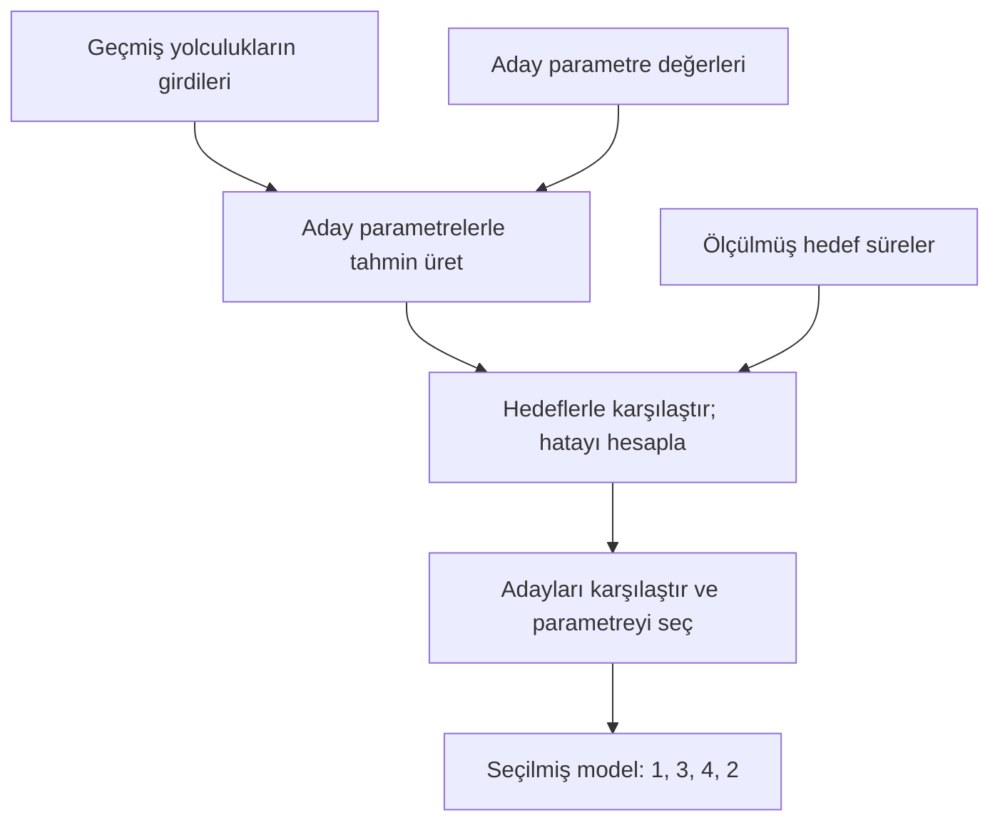

# Ders 06 — Eğitim ve tahmin

[Önceki ders: Model ve parametre](05-model-ve-parametre.md) · [Temeller bölümüne dön](README.md)

**Ön koşul:** Ders 03–05.  
**Ana soru:** Modeli eğitmek ile eğitilmiş modeli kullanmak arasındaki fark nedir?

## Bu dersin sonunda

- Eğitimde girdinin, hedefin ve hata karşılaştırmasının görevlerini açıklayabileceksin.
- Küçük bir aday taramasıyla parametre seçebileceksin.
- Yeni bir örnekte hedefi bilmeden tahmin üretebileceksin.

## 1. Önceki derste eksik bıraktığımız soru

Ders 05'te şu biçimi seçmiştik:

$$
\hat{y}=w_1x_1+w_2x_2+w_3x_3+b
$$

| Sembol | Anlamı | Birim |
|---|---|---|
| $x_1$ | Planlanan mesafe | m |
| $x_2$ | Yük | kg |
| $x_3$ | Planlanan dönüş sayısı | dönüş |
| $\hat{y}$ | Tahmin edilen süre | s |
| $w_1,w_2,w_3$ | Özelliklerin katkılarını ayarlayan ağırlıklar | Sırasıyla s/m, s/kg, s/dönüş |
| $b$ | Sabit terim | s |
| $y$ | Yolculuk sonunda ölçülen hedef süre | s |

Parametreleri örnek için vermiştik. Şimdi sorumuz şu:

> Elimizde geçmiş yolculuklar varken uygun parametreleri nasıl seçebiliriz?

**Eğitim (training)**, burada verilerden yararlanarak modelin parametrelerini seçme veya ayarlama işlemidir. **Tahmin (prediction)** ise belirlenmiş parametrelerle bir girdiyi işleyip çıktı üretmektir. ML uygulamalarında kullanım sırasındaki bu hesaplamaya **çıkarım (inference)** da denir. Bu derste “çıkarım” kelimesini bu anlamda kullanacağız.

Eğitim sırasında da tahmin hesaplanır. Fark şu: Eğitimde bu tahmin, parametre seçimine yol göstermek için hedefle karşılaştırılır.

## 2. Küçük bir eğitim problemi kuralım

Önceki dört kaydı kullanalım:

| Yolculuk | Mesafe (m) | Yük (kg) | Dönüş | Hedef süre (s) |
|---|---|---|---|---|
| A | 10 | 1 | 0 | 15 |
| B | 20 | 1 | 0 | 25 |
| C | 20 | 3 | 0 | 31 |
| D | 20 | 3 | 2 | 39 |

Bunlar özgün, yapay öğretim verileridir. Dört kayıt gerçek bir modelin başarısını göstermek için yeterli veri olarak sunulmuyor.

Hesabı küçük tutmak için bu derste $w_1=1$, $w_3=4$ ve $b=2$ değerlerini sabitleyelim. **Yalnızca yük katsayısı $w_2$'yi veriden seçeceğiz.**

$$
\hat{y}=1x_1+w_2x_2+4x_3+2
$$

Aday değerlerimiz 1, 2 ve 3 s/kg olsun. Bu, üç adayı tek tek deneyen basit bir eğitim yöntemidir. Birçok sayıyı aynı anda öğrenmek için daha verimli yöntemlere ileride geçeceğiz.

## 3. Bir adayın iyi olduğunu nasıl anlayacağız?

Tahmin ile hedef arasındaki farkı hesaplayalım:

$$
e=\hat{y}-y
$$

$e$, tahmin farkıdır; birimi saniyedir. Negatif değer düşük, pozitif değer yüksek tahmin demektir.

Örneğin $w_2=2$ seçersek C yolculuğu için:

$$
\hat{y}=1\cdot20+2\cdot3+4\cdot0+2=28\ \text{s}
$$

Hedef 31 s olduğundan:

$$
e=28-31=-3\ \text{s}
$$

Bu aday C yolculuğunu 3 s kısa tahmin ediyor.

Adayları sıralamak için farkların **mutlak değerlerini** toplayacağız. Mutlak değer, işareti kaldırarak farkın büyüklüğünü verir: $|-3|=3$, $|3|=3$.

İşaretli farkları doğrudan toplasaydık 3 s yüksek ve 3 s düşük tahmin birbirini götürebilirdi. Oysa ikisi de hatalıdır.

## 4. Çözümlü örnek: Üç adayı karşılaştır

| Aday $w_2$ (s/kg) | A tahmini (s) | B tahmini (s) | C tahmini (s) | D tahmini (s) | Toplam mutlak fark (s) |
|---|---|---|---|---|---|
| 1 | 13 | 23 | 25 | 33 | $2+2+6+6=16$ |
| 2 | 14 | 24 | 28 | 36 | $1+1+3+3=8$ |
| 3 | 15 | 25 | 31 | 39 | $0+0+0+0=0$ |

Örneğin ilk adayın D tahmini:

$$
\hat{y}=1\cdot20+1\cdot3+4\cdot2+2=33\ \text{s}
$$

Hedef 39 s; mutlak fark $|33-39|=6$ s.

**Bu adaylar arasında toplam farkı en küçük olan $w_2=3$'ü seçiyoruz.** Seçimimiz yalnızca C satırına değil, dört eğitim kaydına dayanıyor.

Artık parametrelerimiz:

$$
\theta=(w_1,w_2,w_3,b)=(1,3,4,2)
$$

$\theta$, parametreleri birlikte adlandırır. Bu örnekte yalnızca $w_2$ veriden seçildi; diğer üç değeri önceden sabitledik. Bütün parametreleri öğrendiğimizi söylemiyoruz.

Toplam mutlak fark burada eğitim için kullandığımız hata ölçütüdür. Kayıp fonksiyonlarını ve neden farklı ölçütler seçilebildiğini Ders 15'te ayrıntılı işleyeceğiz.

## 5. Görsel: Eğitimde karşılaştırma ve seçim var

Hedef süreler tahmin hesabına giriş olarak verilmez. Karşılaştırma sırasında kullanılır; bu karşılaştırma da hangi parametreyi seçeceğimizi etkiler.

Daha büyük modellerde her adayı tek tek denemek mümkün olmayabilir. Örneğin gradyan inişi, parametrelerin nasıl güncelleneceğine hata ölçütünün türevlerinden yararlanarak karar verir. Onun hesabını Ders 16'da kuracağız.

Burada öğrenme sürecinin fikrini görmek yeterli: **Tahmin üret, hedefle karşılaştır, bu karşılaştırmaya göre parametre seç veya güncelle.**

## 6. Eğitim bitti: Yeni yolculuk geldi

Robot henüz yola çıkmadan şu bilgileri biliyoruz:

- Mesafe: 30 m.
- Yük: 2 kg.
- Planlanan dönüş: 1.

Seçilmiş modelin parametrelerini değiştirmeden hesaplayalım:

$$
\hat{y}=1\cdot30+3\cdot2+4\cdot1+2
$$

$$
\hat{y}=30+6+4+2=42\ \text{s}
$$

Bu yolculuğun gerçek süresini henüz bilmiyoruz. **42 s tahminini üretmek için hedef süreye ihtiyaç duymadık.**

Ders 05'te aynı girdiyi, örnek olarak verilen parametrelerle hesaplamıştık. Şimdi parametre seçiminin küçük bir bölümünü veriden yaparak aynı hesaba ulaştık.

Robot yolculuğu tamamladığında süre 44 s ölçülmüş olsun. Bu yeni hedef, özgün ve varsayımsal bir öğretim değeridir:

$$
e=42-44=-2\ \text{s}
$$

Model 2 s kısa tahmin etmiş. Gerçek süre geldikten sonra **değerlendirme** yapabiliyoruz. Parametreleri sırf hedefi gördüğümüz için kendiliğinden değiştirmedik.

Bu kaydı ileride yeniden eğitimde kullanabiliriz. Ancak parametreleri onunla ayarlarsak, aynı kayıt artık yeni modelin eğitimden bağımsız test örneği sayılmaz.

## 7. Üç işlemi yan yana ayıralım

| İşlem | Kullanılan bilgi | Amaç | Bu düzende parametreler |
|---|---|---|---|
| Eğitim | Geçmiş girdiler ve hedefler | Parametre seçmek veya ayarlamak | Seçilir veya güncellenir |
| Tahmin / çıkarım | Girdi ve belirlenmiş model | Çıktı üretmek | Sabit tutulur |
| Değerlendirme | Tahmin ve ona karşılık gelen hedef | Başarıyı ölçmek | Sırf ölçüm için değiştirilmez |

Değerlendirmede hedefin bilinmesi, onu tahmin sırasında modele verdiğimiz anlamına gelmez.

Model seçiminde sonuçlarına baktığımız **doğrulama verisi (validation data)** ile en son bağımsız başarı ölçümü için ayırdığımız **test verisinin (test data)** görevleri de farklıdır. Ayrıntılarını genelleme dersinde işleyeceğiz. Şimdilik eğitimde iyi görünmenin yeni örneklerde başarı garantisi olmadığını koruyalım.

## 8. Kullanırken de öğrenebilir mi?

Burada eğitim ve kullanımı ayıran bir düzen kurduk. Yeni yolculuklar geldikçe yalnızca tahmin üretiyoruz; daha sonra verileri toplayıp yeniden eğitim yapabiliriz.

**Çevrimiçi öğrenme (online learning)** ise yeni veriler geldikçe modelin güncellenebildiği bir düzendir. Buna ayrı bir eğitim mekanizması gerekir. Her tahmin çağrısı otomatik olarak öğrenme yapmaz.

Bu dersteki çıkarımda geçmiş dört satırı tekrar taramamız da gerekmiyor: Denklem, parametreler ve yeni girdi hesabı yapmaya yeterli. Bazı başka yöntemlerde tahmin için saklanan eğitim örneklerine ihtiyaç duyulur; bunu ilgili yöntemlerde göreceğiz.

Ayrıca yeni girdinin özellik sırası ve birimleri eğitimdekiyle aynı olmalıdır. Metre ile eğittiğimiz modele santimetre cinsinden 3000 değerini doğrudan verirsek, parametreler doğru olsa bile hesabı yanlış koşullarda kullanmış oluruz.

## 9. Kısa deney ve anlama kontrolü

1. $w_2=2$ adayında B yolculuğunun tahminini ve mutlak farkını hesapla. Bu hesabı parametre seçmek için kullanıyorsak hangi aşamadayız?
2. Seçilmiş modelle 25 m, 2 kg, 0 dönüşlü yeni bir yolculuğu hesapla. Gerçek süreyi bilmemiz gerekiyor mu?
3. Yeni yolculuğun hedefi geldikten sonra hatayı hesaplıyoruz ama parametreleri değiştirmiyoruz. Bu işlem eğitim mi? Aynı kayıtla modeli yeniden ayarlarsak ne değişir?

Örnek cevapları göster

**1.** Tahmin $20+2\cdot1+0+2=24$ s. Hedef 25 s olduğu için mutlak fark 1 s. Aday parametreyi bu karşılaştırmayla seçiyorsak eğitim aşamasındayız.

**2.** Tahmin $25+3\cdot2+4\cdot0+2=33$ s. Tahmin hesabı için gerçek hedef süreye ihtiyaç yok.

**3.** Yalnızca hatayı ölçmek değerlendirmedir. Parametreleri bu kayıttan yararlanarak ayarlarsak eğitim yapmış oluruz; bu kayıt güncellenmiş model için bağımsız test örneği olarak kullanılamaz.

## Kaynak ve destek

Tablolar, hesaplar ve şema özgün öğretim materyalleridir.

- **Kısa okuma:** [Dive into Deep Learning — Predictions](https://d2l.ai/chapter_linear-regression/linear-regression.html#predictions), **3.1.1.5 Predictions** alt bölümü. Belirlenmiş ağırlıkların yeni örnekte kullanılışına odaklan.
- **Önceki anlatımla bağlantı:** [Ders 03](03-kurallar-ve-veriden-ogrenme.md) içindeki eşik seçimini bu dersteki yük katsayısı seçimiyle karşılaştır. İkisinde de eğitim verisindeki hatayı kullanarak aday parametreler arasında seçim yaptık.

[Önceki ders: Model ve parametre](05-model-ve-parametre.md) · [Temeller bölümüne dön](README.md)

**Sonraki konu:** Ders 07 — Öğrenme düzenleri *(henüz hazırlanmadı)*.
