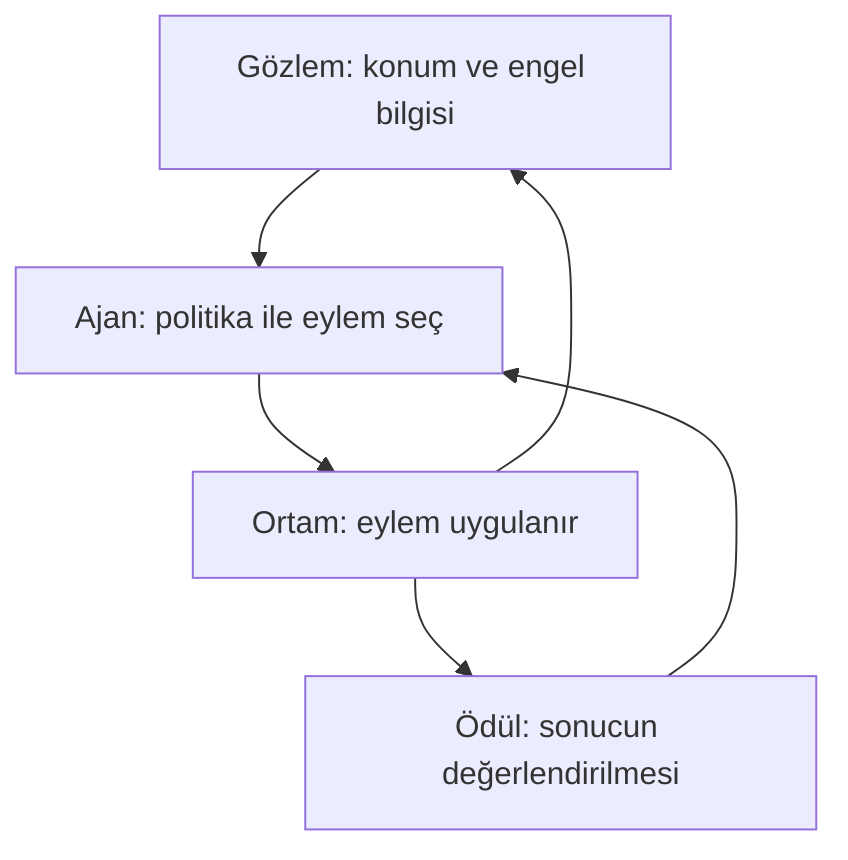

# Ders 07 — Öğrenme düzenleri

[Önceki ders: Eğitim ve tahmin](06-egitim-ve-tahmin.md) · [Temeller bölümüne dön](README.md)

**Ön koşul:** Ders 01–06.  
**Ana soru:** Öğrenme sırasında hangi bilgi modelimize yol gösteriyor?

## Bu dersin sonunda

- Denetimli, denetimsiz ve pekiştirmeli öğrenmeyi örnekler üzerinden ayırabileceksin.
- Hedef etiketi ile ödülün neden aynı şey olmadığını açıklayabileceksin.
- Öğrenme düzeni ile model mimarisinin farklı seçimler olduğunu görebileceksin.

## 1. Aynı robot, üç farklı görev

Bir depo robotuyla ilgili üç soru düşün:

| Soru | Elimizdeki bilgi | Öğrenmek istediğimiz |
|---|---|---|
| Bu yolculuk kaç saniye sürecek? | Geçmiş yolculukların özellikleri ve ölçülmüş süreleri | Girdiden süre tahmini |
| Yolculuk kayıtlarında benzer gruplar var mı? | Yolculukların özellikleri; önceden verilmiş grup etiketleri yok | Verideki benzerlik yapısı |
| Robot hangi eylemleri seçerek teslimatı tamamlamalı? | Eylemlerden sonra oluşan durumlar ve ödüller | İyi bir davranış stratejisi |

Üçünde de robot verisi kullanıyoruz. Fakat **öğrenilecek görev ve öğrenmeye yol gösteren bilgi farklı**. Bu yüzden aynı uygulama alanı, farklı öğrenme düzenleri içerebilir.

## 2. Denetimli öğrenme: Girdinin yanında hedef var

**Denetimli öğrenme (supervised learning)**, eğitim örneklerinde girdilerin karşılık gelen hedeflerle eşleştirildiği düzendir.

Önceki derslerdeki teslim süresi problemi buna örnektir:

| Mesafe (m) | Yük (kg) | Dönüş sayısı | Ölçülmüş hedef süre (s) |
|---|---|---|---|
| 10 | 1 | 0 | 15 |
| 20 | 1 | 0 | 25 |
| 20 | 3 | 0 | 31 |
| 20 | 3 | 2 | 39 |

Bütün sayısal tablolar bu dersler için oluşturulmuş yapay öğretim verileridir.

Tek örneği şöyle yazabiliriz:

$$
(\mathbf{x},y)
$$

- $\mathbf{x}$, mesafe–yük–dönüş sırasındaki üç özellikten oluşan girdi vektörü.
- $y$, aynı yolculukta ölçülmüş hedef süre; birimi saniye.

Model $\mathbf{x}$'ten bir tahmin $\hat{y}$ üretir. Eğitimde $\hat{y}$ ile $y$ karşılaştırılır; parametreler bu karşılaştırmalar kullanılarak seçilir.

**“Denetimli” sözcüğü, bir insanın her eğitim adımını izlemesi demek değildir.** Buradaki süre etiketi otomatik kayıttan gelebilir. Önemli olan, girdiye karşılık gelen hedef bilgisinin eğitimde bulunmasıdır.

Hedef yalnızca sayı da olmak zorunda değildir:

- Süreyi tahmin etmek: Sayısal hedef; **regresyon (regression)**.
- Paketi “kırılabilir / kırılabilir değil” diye ayırmak: Sınıf hedefi; **sınıflandırma (classification)**.

Bu iki görevi sonraki derste açacağız.

## 3. Denetimsiz öğrenme: Hazır hedef etiketi olmadan yapı aramak

**Denetimsiz öğrenme (unsupervised learning)**, burada her örneğe önceden atanmış hedef etiketlerini kullanmadan verinin yapısını öğrenmeye çalıştığımız düzendir.

Örneğin yolculukları bu kez yalnızca mesafelerine göre inceleyelim:

| Yolculuk | Mesafe (m) |
|---|---|
| A | 10 |
| B | 12 |
| C | 40 |
| D | 42 |

“Bu kayıt 1. gruptur” gibi hedefler verilmemiş olsun. Yakın değerleri bir araya getirmek istiyoruz. Bu göreve **kümeleme (clustering)** denir.

### Küçük bir benzerlik hesabı

Bu tek özellikli örnekte uzaklığı iki mesafe arasındaki mutlak farkla ölçelim:

- A ile B: $|10-12|=2$ m.
- A ile C: $|10-40|=30$ m.
- C ile D: $|40-42|=2$ m.

Bu ölçüte göre A–B ve C–D yakın çiftlerdir. İki grup aramaya karar verirsek, bu eşleşmeler makul bir adaydır. Henüz bir kümeleme algoritmasını çalıştırmadık; yalnızca benzerlik fikrini elle kurduk.

**Grupların anlamını otomatik olarak keşfetmiş sayılmayız.** İlk gruba “kısa mesafeli”, ikinciye “uzun mesafeli” adını biz verebiliriz. Grup numaraları gerçek dünyadan gelen doğru cevap etiketleri değildir.

Denetimsiz öğrenme yalnızca kümeleme değildir. İleride çok sayıda özelliği daha az değişkenle temsil etme ve verideki olağandışı örnekleri inceleme görevlerini de göreceğiz.

### Etiket yoksa hiçbir ölçüt de yok mu?

Hayır. Örneğin bir kümeleme yöntemi, aynı grubun üyelerinin birbirine yakın olmasını hedefleyebilir. Dolayısıyla optimize edilen bir ölçüt ve öğrenilen değerler yine olabilir.

Özellik seçimi, uzaklık tanımı ve grup sayısı sonucu etkiler. Mesafe ile kilogramı birlikte kullanacaksak ölçeklerin etkisini de düşünmeliyiz. **Hedef etiketi olmaması, görevin veya varsayımların olmaması değildir.**

## 4. Pekiştirmeli öğrenme: Eylemlerin sonuçlarından davranış öğrenmek

**Pekiştirmeli öğrenme (reinforcement learning, RL)**, bir karar vericinin eylemlerinin sonuçları ve ödül sinyalleri üzerinden davranış öğrenmesini ele alır.

Robot teslimatı nasıl yapacağını öğreniyor olsun:

| Kavram | Anlamı | Örneğimiz |
|---|---|---|
| Ajan (agent) | Eylemleri seçen karar verici | Robotun karar mekanizması |
| Ortam (environment) | Eylemlerden etkilenen sistem | Depo ve robotun hareket dinamikleri |
| Gözlem (observation) | Ajana ulaşan bilgi | Konum tahmini, engel ölçümleri |
| Eylem (action) | Seçilen hareket veya komut | İleri gitmek, dönmek, beklemek |
| Ödül (reward) | Sonucu sayısal olarak değerlendiren sinyal | İlerleme veya başarılı teslimat için tanımlanan değer |
| Politika (policy) | Mevcut bilgiye göre eylem seçme kuralı | Hangi koşulda hangi hareketin seçileceği |

**Durum (state)** ortamın karar problemi açısından ilgili koşullarını temsil eder. Gözlem ise ajanın erişebildiği bilgidir; her zaman durumun tamamını açığa çıkarmayabilir. İleride bu ayrımı ayrıntılı kuracağız.

Eylem, bir sonraki gözlemi etkileyebilir. Eğitimde ajan, deneyimlerden politikasını geliştirmeye çalışır. Şemadaki ödül bağlantısı, her ödülün mutlaka o anda tek bir güncelleme yaptırdığı anlamına gelmez.

**Ödül, genellikle “burada doğru eylem sola dönmekti” demez.** Bir sonucun iyi veya kötü olduğunu bildirir. Ajan bu sonucu hangi önceki seçimlerin etkilediğini öğrenmek zorundadır.

## 5. Çözümlü örnek: Hemen gelen ödül ve toplam sonuç

Basit bir simülasyonda her hareket adımına −1, teslimatın tamamlandığı adıma ayrıca +10 ödül verelim. Böylece teslimat adımının net ödülü $-1+10=9$ olur.

İki rota da çarpışmasız ve başarılı olsun:

| Rota | Adım ödülleri | Toplam |
|---|---|---|
| A: 3 adım | −1, −1, +9 | $-1-1+9=7$ |
| B: 4 adım | −1, −1, −1, +9 | $-1-1-1+9=6$ |

Bu örnekte gelecekteki ödülleri azaltmadan topluyoruz. **Getiri (return)**, burada bu ödüllerin toplamıdır. Bu ölçüte göre A daha iyi.

Son başarılı adımdan önce ödüller negatif olsa da bütün yolculuğun sonucu pozitiftir. Bu nedenle yalnızca o anın ödülüne bakmak yeterli olmayabilir.

Ödülün anlamını biz tasarladık; doğal bir doğruluk etiketi değil. Örneğin çarpışmaları ayrıca ele almayan bu basit ödül, güvenli davranışı tek başına tanımlamaz. Bu hesap, bir RL algoritmasının rota A'yı öğrendiğini de göstermiyor; hangi sonucu tercih etmesini istediğimizi açıklıyor.

Politikanın gerçekten nasıl öğrenildiğini RL bölümünde işleyeceğiz. Eğitim simülasyonda yapılabilir; bazı yöntemler daha önce toplanmış etkileşim kayıtlarından da öğrenebilir.

## 6. Üç düzeni karşılaştır

| Boyut | Denetimli | Denetimsiz | Pekiştirmeli |
|---|---|---|---|
| Temel bilgi | Eşleştirilmiş girdi–hedef örnekleri | Hedef etiketi olmadan veri örnekleri | Gözlem, eylem, sonuç ve ödül deneyimleri |
| Örneğimizde amaç | Süre tahmin etmek | Benzer yolculukları gruplamak | İyi bir davranış politikası öğrenmek |
| Yol gösteren ölçüt | Tahminin hedefle uyumu | Seçilen yapı veya benzerlik ölçütü | Uzun vadeli ödül getirisi |
| “Doğru cevap” | Geçmiş örneğin hedefi bilinir | Önceden verilmiş grup etiketi yok | Her koşulun en iyi eylemi genellikle verilmez |

Bu tablo başlangıç için üç temel düzeni ayırır. Daha sonra karma yaklaşımları da göreceğiz.

## 7. Sinir ağı kullanmak hangi düzen demek?

Ders 02'de AI–ML–DL ilişkisini gördük. Bu ilişkiyle öğrenme düzenini karıştırmayalım:

- **Öğrenme düzeni:** Hangi bilgiyle ve hangi amaçla öğreniyoruz?
- **Model mimarisi:** Girdi hangi hesaplama yapısıyla işleniyor?

Bir yapay sinir ağı, denetimli süre tahmini için de kullanılabilir; etiketsiz veriden temsil öğrenmek için de; RL'de politika oluşturmak için de.

Dolayısıyla **“sinir ağı kullanıyor, o hâlde denetimli öğrenme”** sonucu çıkarılamaz. Aynı şekilde otonom robotun bütün yazılımı RL olmak zorunda değildir: Süre tahmini, algılama, planlama ve kontrol farklı yöntemlerle çözülebilir.

İleride **öz denetimli öğrenmede (self-supervised learning)** hedeflerin verinin kendisinden oluşturulabildiğini, **yarı denetimli öğrenmede (semi-supervised learning)** etiketli ve etiketsiz örneklerin birlikte kullanılabildiğini göreceğiz. Bu derste ayrıntılarını eklemeden temel ayrımı oturtuyoruz.

## 8. Anlama kontrolü

1. Geçmiş motor ölçümlerinde gerilim ve hıza karşılık ölçülmüş sıcaklıklar var. Yeni ölçümde sıcaklığı tahmin etmek hangi düzendir? Etiketleri insanın yazması gerekir mi?
2. Aynı kayıtları sıcaklık hedefi kullanmadan benzer çalışma koşullarına göre grupluyoruz. Hangi düzendir? Bulunan gruplar mutlaka fiziksel arıza sınıfları mıdır?
3. Robot simülasyonda eylem seçip teslimat sonucuna göre ödül alıyor. Bu, neden geçmiş kayıttan teslim süresi tahmin etmekle aynı görev değil?

Örnek cevapları göster

**1.** Denetimli öğrenme. Gerilim ve hız girdilere, ölçülen sıcaklık hedefe örnektir. Etiket otomatik sensör kaydından gelebilir; insanın elle yazması gerekmez.

**2.** Denetimsiz öğrenme; bu görev kümelemedir. Gruplar seçilen özelliklere ve benzerlik ölçütüne bağlıdır. Ek inceleme olmadan gerçek arıza sınıfları olduklarını söyleyemeyiz.

**3.** RL örneğinde davranış seçiyoruz; eylemler sonraki koşulları ve ödülleri etkiliyor. Süre tahmininde ise girdiden bilinen hedefe benzeyen bir çıktı öğreniyoruz. Birinde politika, diğerinde süre tahmin modeli öğrenmek istiyoruz.

## Kaynak ve destek

Robot görevleri, sayısal örnekler ve şema özgün öğretim materyalleridir.

- **Kısa okuma:** [Dive into Deep Learning — Kinds of Machine Learning Problems](https://d2l.ai/chapter_introduction/index.html#kinds-of-machine-learning-problems). **1.3.1 Supervised Learning**, **1.3.2 Unsupervised and Self-Supervised Learning** ve **1.3.4 Reinforcement Learning** bölümlerinin giriş açıklamalarına bak. Kaynak öz denetimli öğrenmeyi de ele alır; şimdilik üç temel düzenin ayrımına odaklan.
- **Önceki dersle bağlantı:** [Ders 06](06-egitim-ve-tahmin.md) içindeki parametre seçimi neden denetimliydi? Eğitimde hedef süreleri nerede kullandığımızı yeniden göster.

[Önceki ders: Eğitim ve tahmin](06-egitim-ve-tahmin.md) · [Temeller bölümüne dön](README.md)

**Sonraki konu:** Ders 08 — Regresyon ve sınıflandırma *(henüz hazırlanmadı)*.
