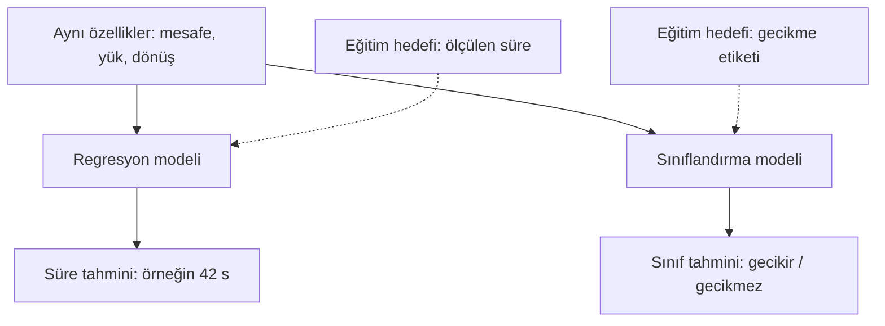

# Ders 08 — Regresyon ve sınıflandırma

[Önceki ders: Öğrenme düzenleri](07-ogrenme-duzenleri.md) · [Temeller bölümüne dön](README.md)

**Ön koşul:** Ders 04–07.  
**Ana soru:** Bir miktarı tahmin etmek ile bir sınıfı tahmin etmek nasıl ayrılır?

## Bu dersin sonunda

- Girdiye değil, hedefin anlamına bakarak regresyon ile sınıflandırmayı ayırabileceksin.
- Aynı yolculuk verisinden iki farklı denetimli görev kurabileceksin.
- Sayısal hata, sınıf hatası ve karar eşiğinin farklı rollerini açıklayabileceksin.

## 1. Aynı girdi, farklı soru

Robot yola çıkmadan mesafeyi, yükü ve planlanan dönüş sayısını biliyoruz.

İki soru sorabiliriz:

| Soru | İstenen cevap | Görev |
|---|---|---|
| Yolculuk kaç saniye sürecek? | Örneğin 42 s | Regresyon |
| Teslimat gecikecek mi? | Gecikir / gecikmez | Sınıflandırma |

İkisinde de geçmiş örneklerin hedeflerini kullanarak öğrenebiliriz; dolayısıyla ikisi de **denetimli öğrenme** düzeninde kurulabilir.

Giriş özelliklerinin aynı olması, hedeflerin aynı olduğu anlamına gelmez. Önce hangi cevabı istediğimizi belirlemeliyiz.

## 2. Regresyon: Bir miktarı tahmin etmek

**Regresyon (regression)**, hedefin bir miktar veya sayısal büyüklük olduğu tahmin görevidir.

Örneğin:

- Teslim süresi: saniye.
- Motor sıcaklığı: °C.
- Enerji tüketimi: kWh.

Teslim süresi örneğinde:

$$
\hat{y}=w_1x_1+w_2x_2+w_3x_3+b
$$

- $x_1$: Mesafe, metre.
- $x_2$: Yük, kilogram.
- $x_3$: Planlanan dönüş sayısı.
- $w_1,w_2,w_3$: Katkıları ayarlayan ağırlıklar; sırasıyla s/m, s/kg ve s/dönüş.
- $b$: Sabit terim, saniye.
- $\hat{y}$: Tahmin edilen süre, saniye.
- $y$: Ölçülen hedef süre, saniye.

Ders 06'da belirlediğimiz $(w_1,w_2,w_3,b)=(1,3,4,2)$ değerleriyle 30 m, 2 kg, 1 dönüş için:

$$
\hat{y}=30+6+4+2=42\ \text{s}
$$

Gerçek süre 44 s ise mutlak tahmin farkı:

$$
|\hat{y}-y|=|42-44|=2\ \text{s}
$$

Burada 2 s hatayla 20 s hata aynı değildir. **Sayısal uzaklığın büyüklüğü** önem taşır.

Regresyon yalnızca doğrusal regresyondan ibaret değildir. Başka model biçimleriyle de miktar tahmin edebiliriz. Ölçümleri tam sayıya yuvarlamak da süreyi bir miktar olmaktan çıkarmaz.

## 3. Sınıflandırma: Bir kategoriyi tahmin etmek

**Sınıflandırma (classification)**, örneğin hangi sınıfa ait olduğunu tahmin etme görevidir.

Teslimat için bir kural tanımlayalım:

> Ölçülen süre 35 saniyeyi aşarsa “gecikir”; 35 saniye veya altındaysa “gecikmez”.

Bu, örneğimizin görev tanımıdır. Eşitlik durumunu da açıkça belirledik.

Sınıf hedefini $c$ ile gösterelim:

$$
c=
\begin{cases}
0, & y\leq35\ \text{s}\\
1, & y>35\ \text{s}
\end{cases}
$$

- $y$: Ölçülen süre.
- $c$: Bu süreden oluşturduğumuz sınıf etiketi.
- 0: Gecikmez.
- 1: Gecikir.

Önceki kayıtlarımızı yeni hedefle yazabiliriz:

| Yolculuk | Mesafe (m) | Yük (kg) | Dönüş | Süre hedefi $y$ (s) | Sınıf hedefi $c$ |
|---|---|---|---|---|---|
| A | 10 | 1 | 0 | 15 | 0 — gecikmez |
| B | 20 | 1 | 0 | 25 | 0 — gecikmez |
| C | 20 | 3 | 0 | 31 | 0 — gecikmez |
| D | 20 | 3 | 2 | 39 | 1 — gecikir |

Tablo ve bu dersteki sayısal örnekler yapay öğretim verileridir.

**0 ve 1 burada sınıf kodlarıdır; saniye değildir.** Bunları 7 ve 9 diye kodlasaydık görev yine aynı sınıflandırma görevi olurdu. Bir sınıf kodunun daha büyük olması, daha fazla bir fiziksel miktar anlamına gelmez.

Benzer şekilde görüntüdeki rakamın “3 mü, 8 mi?” olduğunu tanımak sınıflandırmadır. Rakamlar burada miktar değil, görüntünün ait olduğu kategorilerdir.

## 4. Görsel: Hedef değişince eğitim görevi değişir

Kesikli bağlantılar eğitimde kullanılan hedefleri gösterir. Yeni yolculukta tahmin üretirken bu hedeflere ihtiyaç duymayız.

Şema iki ayrı görevi karşılaştırıyor; bir sınıflandırıcıyı henüz eğitmiş değiliz. Her iki modelin de yeni verideki başarısı ayrıca değerlendirilmelidir.

## 5. Süre tahmininden sınıf kararı çıkarabilir miyiz?

Evet. Regresyon modelinin süre tahminini 35 s eşiğiyle karşılaştırabiliriz.

Tahmin $\hat{y}=42$ s ise $42>35$ olduğundan **“gecikir”** kararı veririz. Bu, regresyon modelinin arkasına eklediğimiz bir karar kuralıdır.

Ancak şu iki yaklaşımı ayıralım:

| Yaklaşım | Eğitimde hedef | Kullanımda işlem |
|---|---|---|
| Regresyon ve ardından eşik | Süre | Süre tahmin et; 35 s ile karşılaştır |
| Doğrudan sınıflandırma | Gecikir / gecikmez etiketi | Sınıf veya sınıf skoru tahmin et |

İlkinde süre hatasını azaltmaya, ikincisinde sınıf tahminini öğrenmeye odaklanıyoruz. Birinin her problemde daha iyi olduğunu varsayamayız.

Süreyi iki sınıfa dönüştürünce bilgi de kaybederiz: 36 s ve 90 s aynı “gecikir” etiketini alır, fakat gecikme miktarları çok farklıdır. Uygulamanın bu miktara ihtiyacı varsa yalnızca sınıf cevabı yeterli olmayabilir.

## 6. Çözümlü örnek: Küçük süre hatası, yanlış sınıf kararı

35 s eşiğiyle iki varsayımsal yeni tahmini inceleyelim:

| Örnek | Gerçek süre (s) | Süre tahmini (s) | Mutlak hata (s) | Gerçek sınıf | Tahminden karar |
|---|---|---|---|---|---|
| E | 36 | 34 | 2 | Gecikir | Gecikmez — yanlış |
| F | 44 | 42 | 2 | Gecikir | Gecikir — doğru |

E örneğinde:

$$
|34-36|=2\ \text{s}
$$

F örneğinde:

$$
|42-44|=2\ \text{s}
$$

Sayısal hatalar eşit. Fakat E'de tahminle hedef, karar eşiğinin farklı taraflarında; F'de aynı tarafında.

**Bu yüzden regresyon hatası ile sınıflandırma başarısı birbirinin yerine geçmez.** Bu iki örnekte bir sınıf kararı doğru olduğu için doğruluk $1/2=0.5$, yani %50'dir. Bu küçük tablo gerçek performans tahmini değildir.

**Doğruluk (accuracy)**, doğru sınıf tahminlerinin toplam örnek sayısına oranıdır. İleride dengesiz sınıflarda neden tek başına yanıltıcı olabileceğini işleyeceğiz.

## 7. Sınıflandırıcı neden bazen ondalıklı sayı verir?

Bazı sınıflandırıcılar önce bir sınıfa ait olma olasılığını tahmin eder. Örneğin:

$$
p=0.7
$$

Burada $p$, modelin “gecikir” sınıfına ait olma olasılığı tahminidir; 0 ile 1 arasında ve birimsizdir. **0.7 saniye veya 0.7 sınıfı** değildir.

Bir **karar eşiği (decision threshold)** seçelim: $\tau=0.5$. $\tau$ eşik sembolüdür. $p\geq\tau$ ise “gecikir”, diğer durumda “gecikmez” diyelim.

- $p=0.7$, $\tau=0.5$: Gecikir.
- Aynı $p=0.7$, $\tau=0.8$: Gecikmez.

Modelin olasılık tahmini değişmedi; karar kuralı değişti.

35 s eşiğiyle bu eşiği karıştırma: **35 s gecikme sınıfını tanımlar; 0.5 ise tahmini olasılıktan sınıf kararı üretir.**

Her sınıflandırıcının skoru olasılık değildir. Olasılık olarak sunulan bir tahminin de gerçek sıklıklarla uyumunu ayrıca değerlendirmek gerekir. Tek bir 0.7 çıktısı, modelin gerçekten güvenilir olduğunu kanıtlamaz.

Örneğin gecikmeyi kaçırmak ile gereksiz alarm vermenin sonuçları farklıysa eşik seçimi bunu dikkate alabilir. Bu seçimi test sonucunu güzelleştirmek için sonradan ayarlamayız; görev ve doğrulama verisi üzerinden belirleriz.

## 8. Kaç sınıf olabilir?

| Tür | Cevap biçimi | Örnek |
|---|---|---|
| İkili sınıflandırma (binary classification) | İki sınıftan biri | Gecikir / gecikmez |
| Çok sınıflı sınıflandırma (multiclass classification) | Birkaç sınıftan biri | Paketin türü: kutu / zarf / tüp |
| Çok etiketli sınıflandırma (multilabel classification) | Aynı örnekte birden fazla etiket | Paket hem kırılabilir hem ağır olabilir |

Bunlar farklı sınıflandırma görevleridir. Başlangıçta ikili sınıflandırmayı kullanacağız.

Yöntem adının tek başına görev türünü söylemediğine de dikkat et: İleride göreceğimiz **lojistik regresyon (logistic regression)**, adına rağmen sınıflandırma için kullanılan bir yöntemdir.

## 9. Anlama kontrolü

1. Bir model motor sıcaklığını °C cinsinden tahmin ediyor. Diğeri motoru “normal / aşırı sıcak” diye ayırıyor. Görevleri nedir? İkisinin girdileri aynı olabilir mi?
2. Sınıfları 0, 1 ve 2 diye kodladık. Bu tek başına görevi regresyon yapar mı? Neden?
3. Gecikme için süre eşiği 35 s. Gerçek süre 34 s, tahmin 36 s. Mutlak süre hatası ve sınıf kararının doğruluğu nedir?

Örnek cevapları göster

**1.** İlki regresyon, ikincisi sınıflandırmadır. Aynı sensör özellikleri kullanılabilir; hedeflerin anlamları farklıdır.

**2.** Hayır. Sayılar kategori koduysa sınıflandırmadır. Kararı sayının yazılışına değil, temsil ettiği hedefe bakarak veririz.

**3.** Mutlak hata $|36-34|=2$ s. Gerçek sınıf “gecikmez”, tahminden üretilen karar “gecikir”; sınıf kararı yanlıştır.

## Kaynak ve destek

Tablolar, hesaplar ve şema özgün öğretim materyalleridir.

- **Kısa okuma:** [Dive into Deep Learning — Regression](https://d2l.ai/chapter_introduction/index.html#regression) ve [Classification](https://d2l.ai/chapter_introduction/index.html#classification), **1.3.1.1** ve **1.3.1.2** alt bölümleri. Miktar tahmini ile kategori tahminini karşılaştır. Daha ileri kayıp fonksiyonlarını şimdilik tamamlaman gerekmiyor.
- **Önceki anlatımla bağlantı:** [Ders 06](06-egitim-ve-tahmin.md) içindeki süre hatasını ve bu dersteki sınıf hatasını yan yana açıklamayı dene.

[Önceki ders: Öğrenme düzenleri](07-ogrenme-duzenleri.md) · [Temeller bölümüne dön](README.md)

**Sonraki konu:** Ders 09 — Yapay nöron *(henüz hazırlanmadı)*.
